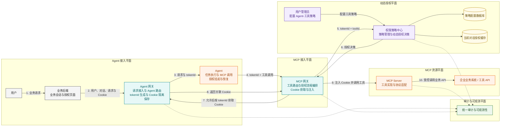
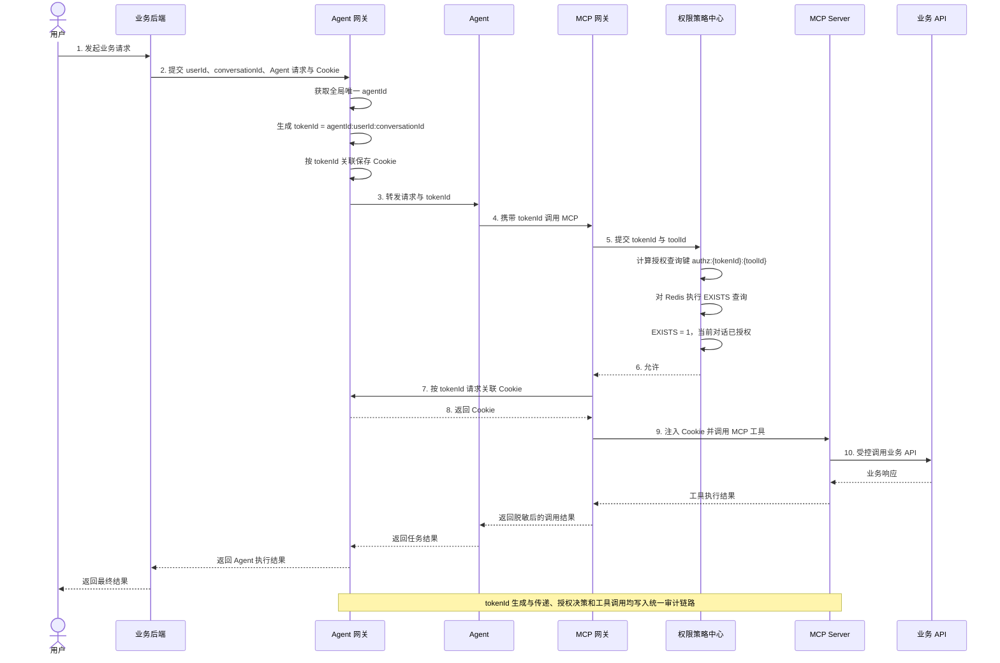
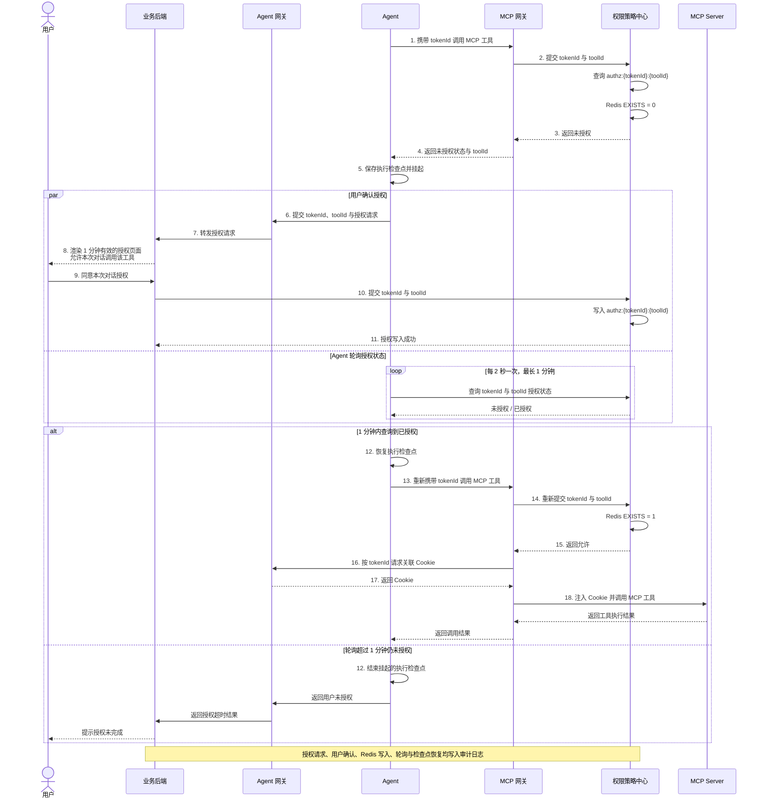

# Agent 动态授权项目总体架构

> 状态：当前架构基线
> 负责人：项目维护者
> 适用版本：V1
> 最后更新：2026-06-09
> 阅读顺序：01
> 文档职责：描述系统参与者、跨模块调用链和职责边界。策略中心内部规则以 [策略中心功能规格](../02-policy-center/01-policy-center-spec.md) 为准。

## 架构范围

当前版本关注以下主链：

```text
用户 -> 业务后端 -> Agent 网关 -> Agent -> MCP 网关
     -> 权限策略中心 -> MCP Server -> 业务 API
```

IAM、IDaaS 等认证系统可以作为 Agent 网关的内部依赖存在，但不属于当前架构边界。

## 总体架构图



## 核心调用时序图

该图表示目标工具需要用户授权，且当前对话授权已经存在的正常调用路径。策略判断规则见 [授权决策](../02-policy-center/01-policy-center-spec.md#授权决策)。



## 未授权人在回路授权时序图

该图表示目标工具需要用户授权，但当前对话授权不存在时的挂起、确认和恢复路径。



## 组件边界

| 组件 | 核心职责 | 明确边界 |
| --- | --- | --- |
| 业务后端 | 承接业务请求和会话、提供用户与对话上下文、展示授权页面 | 不生成 tokenId，不执行策略判断 |
| Agent 网关 | Agent 路由、生成 tokenId、隔离保存 Cookie | 不执行工具授权决策 |
| Agent | 执行任务、调用 MCP、未授权时挂起和恢复 | 不接触 Cookie，不自行判断授权 |
| MCP 网关 | 工具接入、调用策略中心、依据决策控制工具调用 | 不制定策略，不长期保存 Cookie |
| 权限策略中心 | 管理 Agent-工具策略、处理当前对话授权、返回授权决策 | 不生成 tokenId，不调用 MCP 工具 |
| MCP Server | 实现工具并访问业务 API | 不管理用户授权策略 |

## 跨模块约束

- `tokenId` 当前由 Agent 网关按 `agentId:userId:conversationId` 生成，仅作为授权上下文关联标识。
- Agent 只透传 tokenId，不能接触 Cookie、长期 Token、密钥或其他原始业务凭证。
- MCP 网关只有在权限策略中心明确返回 `ALLOW` 后，才能获取 Cookie 并调用 MCP Server。
- 当前版本只支持本次对话授权；跨对话授权属于未来演进能力。
- 工具授权判断、配置变更和最终调用必须能够通过 tokenId 关联审计。

## 相关文档

- [文档导航](../README.md)
- [策略中心功能规格](../02-policy-center/01-policy-center-spec.md)
- [策略中心 API 契约](../02-policy-center/02-api-contract.md)
- [策略中心数据模型](../02-policy-center/03-data-model.md)
- [策略中心验收场景](../02-policy-center/04-acceptance-scenarios.md)
- [未来授权能力演进](../04-future/01-future-authorization-evolution.md)
