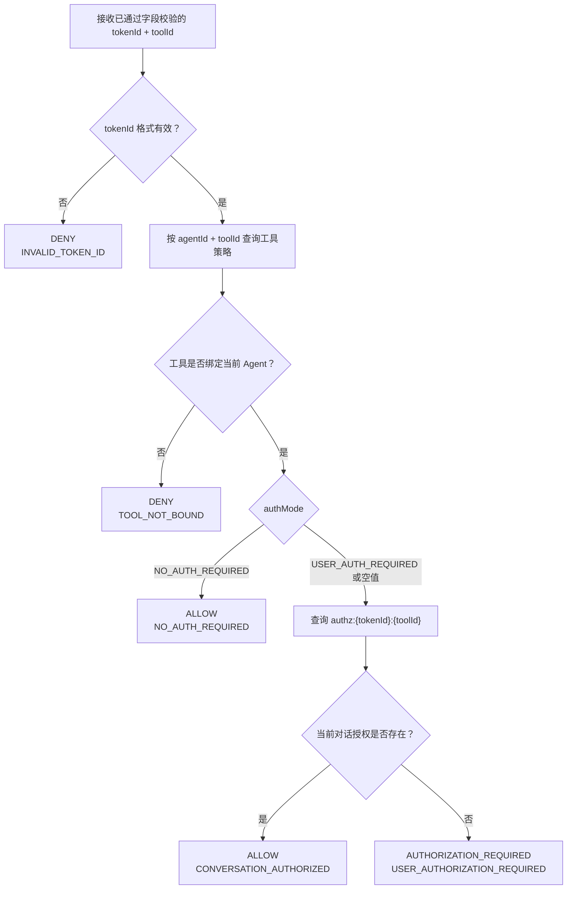

# 权限策略中心功能规格

> 状态：当前版本功能基线
> 负责人：项目维护者
> 适用版本：V1
> 最后更新：2026-06-09
> 阅读顺序：02-01
> 文档职责：策略中心功能行为的唯一事实来源。接口字段见 [API 契约](02-api-contract.md)，存储细节见 [数据模型](03-data-model.md)。

## 目标与职责

权限策略中心负责：

- 管理 Agent 与 MCP 工具的绑定关系和授权标签。
- 根据 `tokenId + toolId` 返回运行时授权决策。
- 保存、查询和清理当前对话的工具授权。
- 为管理员配置、授权判断和用户确认生成审计事件。

权限策略中心不负责：

- 生成 tokenId 或验证用户登录态。
- 保存、返回或注入 Cookie。
- 路由、执行 MCP 工具或访问业务 API。
- 管理跨对话或长期授权。

## 核心概念

### tokenId

当前格式为：

```text
tokenId = agentId:userId:conversationId
```

- `agentId` 全局唯一，由 Agent 网关确定。
- 三个字段必须非空且不得包含 `:`。
- tokenId 是授权上下文关联标识，不是签名 Token，也不具备防篡改能力。
- 策略中心从 tokenId 解析 `agentId`，用于查询 Agent-工具策略。

### 工具策略

每个 Agent 与工具的绑定记录拥有一个 `authMode`：

| authMode | 含义 |
| --- | --- |
| `NO_AUTH_REQUIRED` | 工具已绑定，可直接调用，不需要用户确认 |
| `USER_AUTH_REQUIRED` | 工具已绑定，必须存在当前对话授权 |

策略中心只保存管理员选择绑定到 Agent 的工具。每条记录表示一个 `agentId + toolId + authMode` 绑定关系。

记录不存在表示该 Agent 未绑定该工具，即使该工具存在于 MCP 网关当前全量工具列表中，运行时也必须按未绑定处理。历史数据中的空 `authMode` 按 `USER_AUTH_REQUIRED` 处理。

### 当前对话授权

当前版本的授权粒度固定为：

```text
agentId + userId + conversationId + toolId
```

授权记录使用 `authz:{tokenId}:{toolId}` 表示，只在当前对话中生效。

## 授权决策

输入：

```text
tokenId + toolId
```

输出：

```text
decision: ALLOW | AUTHORIZATION_REQUIRED | DENY
reason:
- NO_AUTH_REQUIRED
- CONVERSATION_AUTHORIZED
- USER_AUTHORIZATION_REQUIRED
- TOOL_NOT_BOUND
- INVALID_TOKEN_ID
- POLICY_STORE_UNAVAILABLE
- AUTHORIZATION_STORE_UNAVAILABLE
```

决策流程：



强制规则：

1. 字段缺失或空白时拒绝请求，不进入授权决策；tokenId 无法无歧义解析时返回拒绝决策。
2. 策略配置数据库不可用时返回 `DENY + POLICY_STORE_UNAVAILABLE`。
3. 未绑定工具直接拒绝，不得进入用户授权流程。
4. `NO_AUTH_REQUIRED` 直接允许，不查询当前对话授权缓存。
5. `USER_AUTH_REQUIRED` 或空标签才查询当前对话授权。
6. Redis 查询异常时返回 `DENY + AUTHORIZATION_STORE_UNAVAILABLE`，不得视为缓存未命中。
7. 只有 `AUTHORIZATION_REQUIRED` 可以触发用户授权页面；其他拒绝原因均不得触发。
8. 只有明确的 `ALLOW` 可以驱动 MCP 网关获取 Cookie 和调用工具。

## 管理员配置

管理员配置旅程：

1. 管理员从 Agent 网关提供的能力中选择其有权限管理的 Agent。
2. 管理员查看 MCP 网关提供的当前全量工具列表。
3. 管理员从当前全量工具列表中选择部分工具绑定到目标 Agent。
4. 管理员在矩阵中为已选择工具配置 `NO_AUTH_REQUIRED` 或 `USER_AUTH_REQUIRED`。
5. 新绑定但未选择标签的工具按 `USER_AUTH_REQUIRED` 保存。
6. 保存时提交目标 Agent 的完整已绑定工具策略列表。
7. 策略中心在单个事务中新增或更新请求内记录，并删除请求中未包含的旧绑定。
8. 策略中心不复制 MCP 工具目录，不保存未选择工具。

管理员身份认证、Agent 管理权限校验以及工具目录真实性校验的接入方式目前为 `TBD`。

## 人在回路授权

触发条件：

```text
decision = AUTHORIZATION_REQUIRED
reason = USER_AUTHORIZATION_REQUIRED
```

流程：

1. MCP 网关向 Agent 返回未授权状态和 `toolId`。
2. Agent 保存执行检查点并挂起当前工具调用。
3. Agent 经 Agent 网关把 `tokenId + toolId` 授权请求传给业务后端。
4. 业务后端展示“允许本次对话调用该工具”的授权页面。
5. 授权页面及业务后端维护的服务端授权会话有效期均为 1 分钟。
6. 用户同意后，业务后端调用策略中心确认接口，提交 `tokenId + toolId`。
7. 策略中心再次确认工具仍绑定且仍需要用户授权，然后幂等写入当前对话授权。
8. Agent 每 2 秒查询一次授权状态，最长等待 1 分钟。
9. 查询成功后，Agent 恢复检查点并重新调用 MCP 网关。
10. MCP 网关必须重新执行完整授权决策，不得沿用首次结果。
11. 超过 1 分钟仍未授权时，Agent 结束挂起任务并返回授权未完成。

业务后端如何向策略中心证明“用户确认确实发生且服务端授权会话未超时”目前为 `TBD`。在该机制确定前，确认接口必须仅对受信任的业务后端开放。

## 对话结束

- 业务后端在对话结束或删除时通知策略中心清理该 tokenId 的全部工具授权。
- 清理操作必须幂等。
- 清理后，相同 tokenId 的下一次授权检查不得命中旧记录。
- 对话结束与迟到授权确认并发时的最终一致性机制目前为 `TBD`；实现前必须确定，避免已结束对话被重新写入授权。

## 失败处理

| 场景 | 行为 |
| --- | --- |
| 请求字段缺失或空白 | `400 + INVALID_REQUEST`，不执行策略判断 |
| tokenId 非法 | `DENY + INVALID_TOKEN_ID` |
| 工具未绑定 | `DENY + TOOL_NOT_BOUND` |
| 策略数据库不可用 | `DENY + POLICY_STORE_UNAVAILABLE` |
| 当前对话授权不存在 | `AUTHORIZATION_REQUIRED + USER_AUTHORIZATION_REQUIRED` |
| Redis 不可用或超时 | `DENY + AUTHORIZATION_STORE_UNAVAILABLE` |
| 授权页面超时 | 不写入授权，Agent 最终结束挂起 |
| MCP 网关收到 `DENY` | 终止工具调用，不获取 Cookie |

所有依赖异常均遵循 fail-closed：不得因数据库、Redis、网络或解析异常而放行工具。

## 审计要求

至少记录以下事件：

- 管理员整份保存 Agent-工具策略。
- 每次运行时授权决策及原因。
- 用户确认当前对话授权。
- Agent 授权状态轮询结果。
- 对话结束授权清理。

每条事件至少携带：

```text
eventType
occurredAt
tokenId（存在时）
agentId（可解析时）
toolId（存在时）
decision / reason（决策事件）
caller
traceId
```

审计日志不得包含 Cookie 或其他原始业务凭证。

## 当前未决项

以下内容在编码对应能力前需要确认：

1. 服务框架、数据库类型和 Redis 客户端。
2. 内部接口认证方式及调用方身份传递方式。
3. 管理员身份与 Agent 管理权限的校验方式。
4. 用户确认的不可伪造证明及 1 分钟服务端会话校验方式。
5. 对话结束与迟到确认的并发仲裁方式。
6. 当前对话授权记录的物理安全 TTL。
