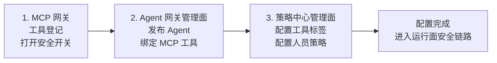
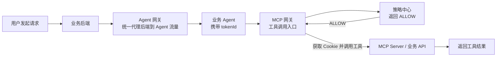
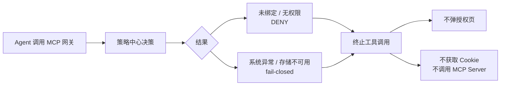

# 开发者接入用户旅程
> 状态：V1 宣讲稿
> 适用对象：业务团队负责人、业务后端开发者、业务 Agent 开发者、联调负责人
> 最后更新：2026-06-16
> 阅读顺序：5-01
> 文档职责：帮助业务方理解接入旅程和各系统分工。接口字段以 [业务后端与业务 Agent 接入指南（参考材料）](99-reference-business-backend-agent-integration-guide.md) 和 [策略中心对外接口参考](../02-policy-center/08-external-api-reference.md) 为准。

## 1. 接入前后变化

先抓住最重要的变化：用户入口不变，业务页面不变，但后端到 Agent、Agent 到 MCP 工具的路径会进入统一安全链路。

| 对比项 | 接入前 | 接入后 |
| --- | --- | --- |
| 后端到 Agent | 业务后端可能直接请求 Agent | 所有业务后端到 Agent 的流量先经过 Agent 网关 |
| 用户凭证 | Agent 可能感知 Cookie 或凭证上下文 | Agent 只接收 `tokenId`，不接触 Cookie |
| 工具调用 | Agent 自己处理 MCP 工具调用上下文 | Agent 调工具统一经过 MCP 网关 |
| 授权判断 | 分散在业务代码、Agent 或工具侧 | 策略中心统一决策，MCP 网关按结果放行 |


1. 后端到 Agent 的入口统一收敛到 Agent 网关。
2. Agent 不再接触 Cookie，只透传 `tokenId`。
3. MCP 工具调用由 MCP 网关和策略中心统一拦截、判断和放行。

## 2. 管理面配置旅程

运行面安全链路生效前，先完成三类配置：工具登记、Agent 发布绑定、策略配置。



### 第一步：MCP 网关配置工具，并打开安全开关

业务方先把可被 Agent 调用的 MCP 工具登记到 MCP 网关，并为需要纳入治理的工具打开安全开关。

这一步的目的，是让平台知道“有哪些工具可以被调用”，以及“哪些工具必须进入 `tokenId + 策略决策 + 凭证隔离` 的安全链路”。

### 第二步：Agent 网关管理面发布 Agent，并绑定 MCP 工具

业务方在 Agent 网关管理面发布 Agent 信息，并选择该 Agent 计划使用的 MCP 工具。

这一步的目的，是让平台知道请求应该路由到哪个 Agent，以及该 Agent 的工具使用范围。对业务方来说，可以理解为：这个 Agent 被纳入了哪些 MCP 工具的安全治理。

### 第三步：策略中心管理面配置工具标签和人员策略

工具完成登记和绑定后，策略中心管理面负责配置已绑定工具的授权标签和人员策略。

当前 V1 的工具授权标签包括：

```text
NO_AUTH_REQUIRED   = 无需用户授权
USER_AUTH_REQUIRED = 需要用户授权
PER_CALL_AUTH_REQUIRED = 每次调用都需要用户授权
```

这一步的目的，是把“工具能不能调”“是否需要用户确认”“哪些人可以使用”从业务代码里拿出来，变成可配置、可审计、可调整的安全策略。

## 3. 运行面三个 User Case

运行面不用记住每个底层接口，只要分清三种结果：直接放行、用户授权后继续、直接拒绝。

### User Case 1：无需授权，工具直接调用成功

适用场景：管理员已经把工具配置为 `NO_AUTH_REQUIRED`，或者当前调用满足直接放行策略。



业务方需要记住：只有 `ALLOW` 后，MCP 网关才可以获取 Cookie 并调用 MCP Server；Agent 本身不接触 Cookie。

### User Case 2：需要授权，用户确认后继续

适用场景：工具配置为 `USER_AUTH_REQUIRED`，且当前对话还没有该工具的授权记录。

```mermaid
flowchart LR
    agentRequest["Agent 调用 MCP 网关"]
    policyNeedAuth["策略中心<br/>返回 AUTHORIZATION_REQUIRED"]
    pauseExecution["Agent 保存检查点<br/>暂停当前工具调用"]
    authPage["业务后端展示授权页"]
    userConfirm["用户同意<br/>本次对话授权"]
    grantSaved["策略中心记录授权"]
    resumeExecution["Agent 恢复检查点"]
    retryGateway["重新经过 MCP 网关鉴权"]
    toolSuccess["ALLOW 后调用工具成功"]

    agentRequest --> policyNeedAuth
    policyNeedAuth --> pauseExecution
    pauseExecution --> authPage
    authPage --> userConfirm
    userConfirm --> grantSaved
    grantSaved --> resumeExecution
    resumeExecution --> retryGateway
    retryGateway --> toolSuccess
```



业务方需要记住：用户同意后，Agent 不能直接绕过 MCP 网关继续调用工具，必须恢复检查点并重新经过 MCP 网关鉴权。

如果工具配置为 `PER_CALL_AUTH_REQUIRED`，流程仍然类似，但用户每同意一次只允许下一次重试通过；下一次再调用同一工具时，还会重新进入用户确认。

### User Case 3：未绑定、无权限或系统异常，直接拒绝

适用场景：工具未绑定、用户不在人员策略范围内、`tokenId` 非法，或策略中心、数据库、Redis 等关键依赖不可用。



业务方需要记住：`DENY` 和系统异常不是“让用户再授权一次”，而是直接结束本次工具调用。未绑定工具也不能通过用户授权绕过管理面配置。

## 4. 各业务团队需要做什么

### 业务后端团队

- 发起 Agent 请求时，把用户、对话、请求内容和 Cookie 提交给 Agent 网关。
- 接收 Agent 网关转发的授权请求，展示 1 分钟有效的授权页面。
- 用户同意后，由服务端调用策略中心写入当前对话授权。
- 对话结束或删除时，清理当前对话授权。
- 浏览器页面不要直接调用策略中心。

### 业务 Agent 团队

- 从 Agent 网关接收并透传 `tokenId`。
- 调用工具时始终经过 MCP 网关，不直接调用 MCP Server 或业务 API。
- 收到未授权时保存检查点并挂起。
- 用户授权成功后恢复检查点，但必须重新经过 MCP 网关鉴权。
- 日志中不要记录 Cookie、业务 Token、密码或密钥。

### 管理员和平台配置人员

- 在 MCP 网关完成工具登记，并打开安全开关。
- 在 Agent 网关管理面完成 Agent 发布和 MCP 工具绑定。
- 在策略中心管理面为已绑定工具配置授权标签和人员策略。
- 接入前至少验证一个无需授权工具、一个需要授权工具、一个未绑定或无权限场景。

## 5. 接入完成验收

业务方完成接入后，可以按下面清单验收：

| 验收项 | 通过标准 |
| --- | --- |
| MCP 工具配置 | 工具已在 MCP 网关登记，并对需要治理的工具打开安全开关 |
| Agent 发布 | Agent 已在 Agent 网关管理面发布，业务请求能被路由到目标 Agent |
| 工具绑定 | Agent 已绑定计划使用的 MCP 工具 |
| 策略配置 | 策略中心能看到已绑定工具，并能配置授权标签和人员策略 |
| 无需授权工具 | `NO_AUTH_REQUIRED` 工具不弹授权页面即可调用成功 |
| 需要授权工具 | `USER_AUTH_REQUIRED` 工具首次调用能触发授权页面 |
| 每次授权工具 | `PER_CALL_AUTH_REQUIRED` 工具每次调用都能触发授权页面，用户同意后仅放行一次 |
| 授权后恢复 | 用户同意后，Agent 能恢复检查点并完成工具调用 |
| 未授权超时 | 用户未在 1 分钟内同意时，Agent 能结束挂起任务 |
| 拒绝场景 | 未绑定、无权限、系统异常不会绕过安全链路 |
| 凭证隔离 | 业务 Agent 全程不接触 Cookie、长期 Token 或业务密钥 |

## 6. 常见误区

### 误区一：Agent 拿到 tokenId，就等于可以直接调工具

不是。`tokenId` 只是授权上下文关联标识。真正决定工具是否能调用的是 MCP 网关向策略中心发起的运行时鉴权结果。

### 误区二：用户授权成功后，Agent 可以直接恢复执行工具

不是。授权成功后，Agent 只能恢复任务检查点，并重新调用 MCP 网关。MCP 网关必须再次向策略中心确认 `ALLOW` 后才能调用 MCP Server。

### 误区三：工具未绑定时也可以让用户授权

不能。工具未绑定表示该 Agent 没有进入该工具的治理范围，必须直接拒绝，不能通过用户授权绕过管理面配置。

### 误区四：策略中心负责保存或返回 Cookie

不是。策略中心只负责策略和授权决策，不保存 Cookie，也不返回 Cookie。Cookie 隔离保存和按 `tokenId` 取回由 Agent 网关负责；MCP 网关只在 `ALLOW` 后才获取并注入。

## 7. 相关文档

- [项目总体架构](../01-architecture/01-project-overall-architecture.md)
- [开发人员详细接入文档](02-developer-integration-api-guide.md)
- [业务后端与业务 Agent 接入指南（参考材料）](99-reference-business-backend-agent-integration-guide.md)
- [H2A 代理功能设计文档](../06-agent-gateway/01-agent-gateway-project-overall-architecture.md)
- [策略中心对外接口参考](../02-policy-center/08-external-api-reference.md)
- [管理面前端接口](../02-policy-center/06-admin-frontend-api.md)
