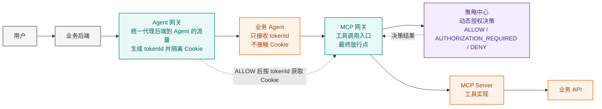
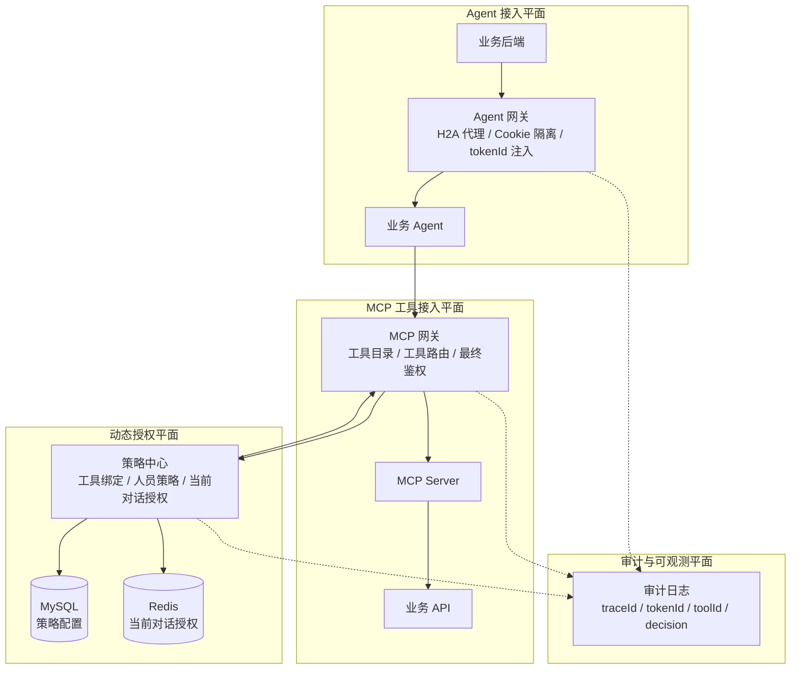
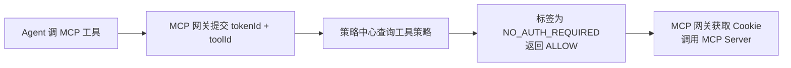
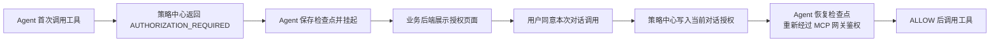
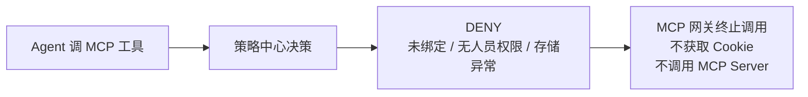

# Agent 动态授权安全整体方案（DRB 评审）

> 状态：CTO/DRB 评审材料
> 负责人：项目维护者
> 适用版本：V1
> 最后更新：2026-06-16
> 阅读顺序：07-00
> 文档职责：先从黑盒讲清整体价值、主链路和模块分工，再指向策略中心与 Agent 网关的白盒方案。

## 1. 方案要解决什么问题

Agent 接入 MCP 工具后，原来的“业务后端调用 Agent”会扩展成“Agent 代表用户调用企业工具”。如果不加统一安全链路，风险会集中出现在四个地方：

| 风险 | 典型表现 | 方案控制点 |
| --- | --- | --- |
| 凭证暴露 | Agent 直接拿到 Cookie、长期 Token 或业务密钥 | Agent 网关隔离保存 Cookie，Agent 只拿 `tokenId` |
| 授权分散 | 每个 Agent 自己判断哪些工具能调用 | MCP 网关统一在调用前请求策略中心鉴权 |
| 审计缺失 | 无法解释“哪个用户、哪个 Agent、哪个工具、为什么放行” | `tokenId + toolId + decision + traceId` 统一审计 |
| 异常放行 | 数据库、Redis 或策略服务异常时继续调用工具 | 策略中心和 MCP 网关统一 fail-closed |

一句话概括：

```text
业务流量仍然去 Agent，但所有后端到 Agent 的入口先经过 Agent 网关；
Agent 调工具必须经过 MCP 网关；
工具是否能调用由策略中心统一给出决策。
```

## 2. 黑盒主链路

当前 V1 的安全主链固定为：

```text
用户 -> 业务后端 -> Agent 网关 -> Agent -> MCP 网关
     -> 策略中心 -> MCP Server -> 业务 API
```



黑盒视角下，各模块只需要记住自己的边界：

| 模块 | 对外表现 | 不做什么 |
| --- | --- | --- |
| Agent 网关 | 业务后端统一通过它代理到 Agent；它隔离 Cookie 并下发 `tokenId` | 不判断 MCP 工具是否允许调用 |
| 业务 Agent | 执行业务任务，调用 MCP 网关 | 不保存 Cookie，不直接调用业务 API |
| MCP 网关 | 所有 MCP 工具调用前的最终门禁 | 不制定策略，不绕过策略中心 |
| 策略中心 | 输入 `tokenId + toolId`，输出授权决策 | 不保存 Cookie，不执行工具 |

## 3. 分层方案



分层的目的不是增加调用复杂度，而是把风险放到能集中控制的地方：

- Agent 接入平面控制“谁在代表用户访问 Agent”。
- MCP 工具接入平面控制“Agent 想调用哪个工具”。
- 动态授权平面控制“这个用户、这个 Agent、这个工具、当前上下文是否允许”。
- 审计平面控制“出了问题能不能还原链路”。

## 4. V1 能力范围

V1 已覆盖：

- 后端到 Agent 的流量统一通过 Agent 网关代理。
- Agent 网关隔离保存 Cookie，并向 Agent 注入 `tokenId`。
- 策略中心管理 Agent-工具绑定、工具授权标签和人员策略。
- MCP 网关在工具调用前提交 `tokenId + toolId` 到策略中心。
- 策略中心支持三态决策：`ALLOW`、`AUTHORIZATION_REQUIRED`、`DENY`。
- 支持“本次对话有效”的人在回路授权。
- 支持对话结束后清理当前对话授权。
- 数据库、Redis、策略服务异常时默认拒绝。

V1 暂不提供，相关能力开发中：

- 跨对话 7 天或 30 天授权。
- 用户授权列表和主动撤销。
- 不透明随机 `tokenId`。
- Agent-工具策略 Redis 缓存。
- 统一链路追踪平台接入。

## 5. 关键安全原则

| 原则 | 说明 |
| --- | --- |
| Agent 不接触 Cookie | Cookie 由 Agent 网关隔离保存；Agent 只透传 `tokenId` |
| MCP 网关最终放行 | 即使业务 Agent 做了预检，真正调用工具前仍必须经过 MCP 网关鉴权 |
| 策略中心 fail-closed | 策略库、Redis 或解析异常不得放行工具 |
| 未绑定不能授权 | 工具未绑定当前 Agent 时直接拒绝，不进入用户授权页面 |
| 授权后重新鉴权 | 用户同意后，Agent 必须重新经过 MCP 网关和策略中心，不得直接执行工具 |
| 全链路可审计 | 关键事件记录 `traceId`、`tokenId`、`agentId`、`toolId`、`decision` 和 `reason` |

## 6. 典型运行路径

### 6.1 无需授权工具



### 6.2 需要用户授权工具



### 6.3 拒绝或异常



## 7. 与现有系统的关系

- IAM、IDaaS 等认证系统可以继续作为 Agent 网关或业务后端的内部依赖，不进入当前动态授权主链。
- 业务后端继续负责业务会话、用户上下文和授权页面体验。
- MCP Server 继续负责工具协议和业务 API 适配，不需要理解用户授权策略。
- 策略中心不复制 Agent 目录、MCP 工具目录或用户目录；这些目录仍由各自责任系统维护。

## 8. DRB 关注点

| 评审点 | 当前结论 |
| --- | --- |
| 是否降低凭证暴露面 | 是，Cookie 只在 Agent 网关与受控 MCP 网关链路中使用 |
| 是否有统一授权出口 | 是，MCP 网关调用策略中心后才允许工具执行 |
| 是否默认安全 | 是，异常和未知状态均 fail-closed |
| 是否支持业务体验 | 是，支持人在回路授权和任务恢复 |
| 是否可演进 | 是，当前 `tokenId + toolId` 接口可兼容未来不透明 tokenId 和跨对话授权 |

## 9. 相关设计文档

- [项目总体架构](../01-architecture/01-project-overall-architecture.md)
- [权限策略中心方案设计](01-policy-center-solution-design.md)
- [Agent 网关方案设计](02-agent-gateway-solution-design.md)
- [策略中心功能规格](../02-policy-center/01-policy-center-spec.md)
- [策略中心 API 契约](../02-policy-center/02-api-contract.md)
- [Agent 网关 H2A 代理设计](../06-agent-gateway/01-agent-gateway-project-overall-architecture.md)
- [开发者接入用户旅程](../05-integration/01-developer-access-user-journey.md)
