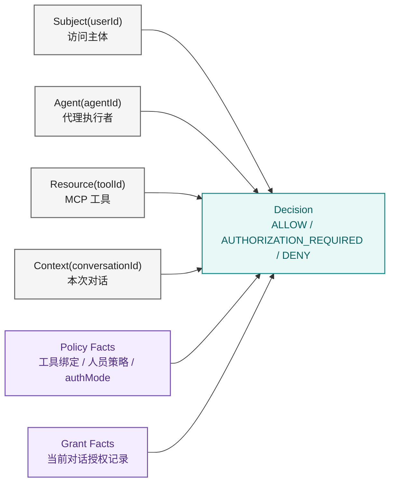
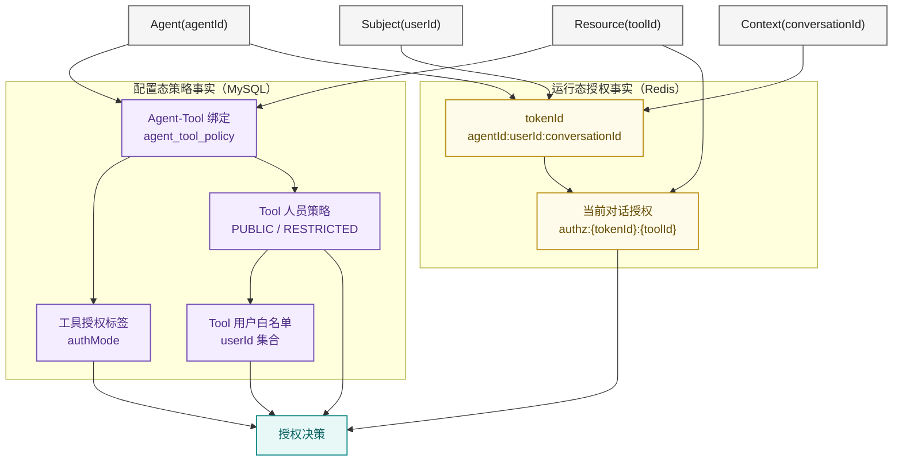
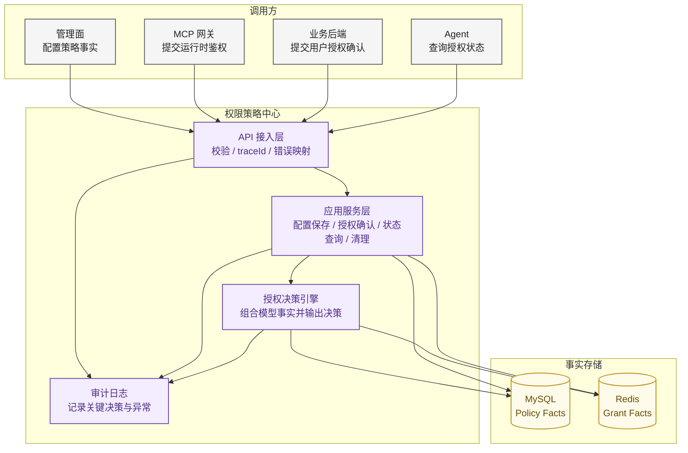
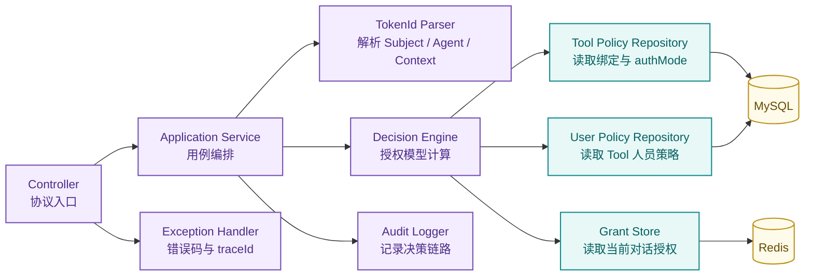
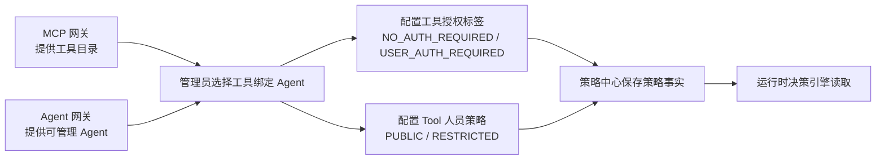
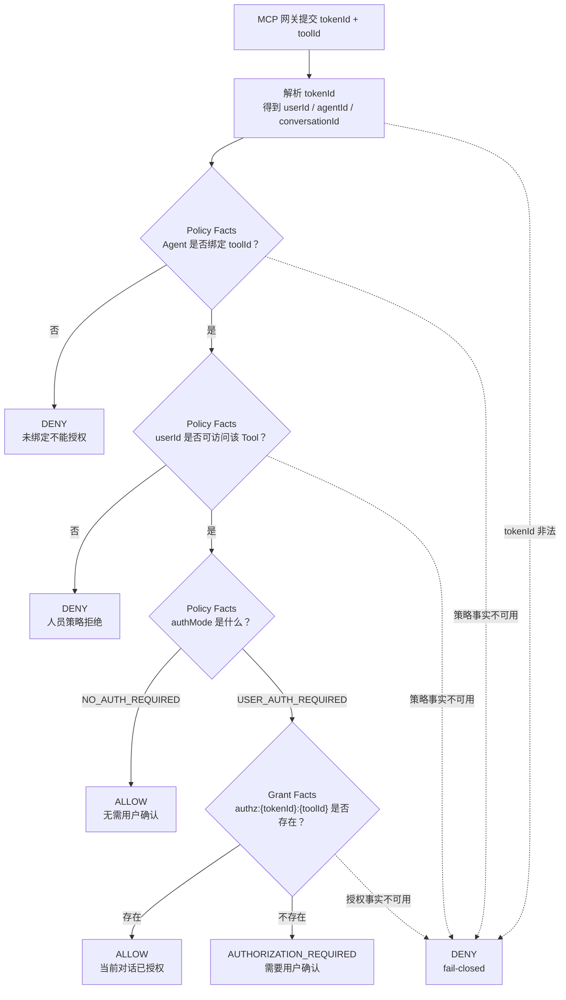
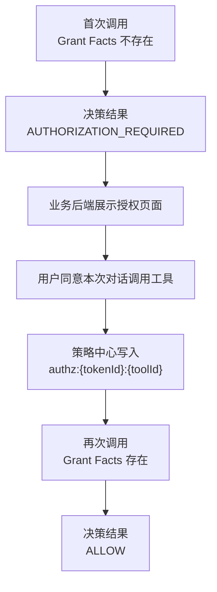

# 权限策略中心方案设计

> 状态：方案设计材料
> 负责人：项目维护者
> 适用版本：V1
> 最后更新：2026-06-16
> 阅读顺序：07-01
> 文档职责：说明策略中心为什么能决策、授权模型如何组织、一次工具调用如何得到授权结果。详细接口和存储规则以 [策略中心功能规格](../02-policy-center/01-policy-center-spec.md)、[API 契约](../02-policy-center/02-api-contract.md) 和 [数据模型](../02-policy-center/03-data-model.md) 为准。

## 1. 策略中心的决策依据

策略中心能做授权决策，不是因为它能识别用户登录态，也不是因为它保存 Cookie，而是因为它掌握了两类事实：

| 事实类型 | 来源 | 解决的问题 |
| --- | --- | --- |
| 策略事实（Policy Facts） | 管理员在策略中心配置，并持久化到 MySQL | 当前 Agent 是否绑定该工具、该工具是否需要授权、当前用户是否可访问该工具 |
| 授权事实（Grant Facts） | 用户在当前对话中确认授权后，由业务后端写入 Redis | 当前 `tokenId + toolId` 是否已经在本次对话中被用户允许 |

一次运行时请求只带来两个输入：

```text
tokenId + toolId
```

策略中心从 `tokenId` 解析出：

```text
agentId + userId + conversationId
```

于是策略中心可以组合出完整问题：

```text
这个 userId 是否可以通过这个 agentId，
在这个 conversationId 中，
调用这个 toolId？
```

这就是策略中心能决策的根本原因：策略中心掌握策略事实和当前对话授权事实；MCP 网关在工具执行前把运行时上下文提交给它，它就能给出确定结论。策略中心不持有凭证，也不需要执行工具。

## 2. 授权模型

策略中心的授权模型可以表达为：

```text
Subject + Agent + Resource + Context + Policy Facts + Grant Facts -> Decision
```

| 模型元素 | 当前字段 | 含义 |
| --- | --- | --- |
| Subject | `userId` | 访问主体，即当前用户 |
| Agent | `agentId` | 代理执行者，即代表用户执行任务的 Agent |
| Resource | `toolId` | 被访问资源，即 MCP 工具 |
| Context | `conversationId` | 授权上下文，即本次业务对话或会话 |
| Policy Facts | 工具绑定、人员策略、`authMode` | 管理员预先配置的策略事实 |
| Grant Facts | `authz:{tokenId}:{toolId}` | 用户在当前对话中确认后的授权事实 |
| Decision | `ALLOW / AUTHORIZATION_REQUIRED / DENY` | 策略中心输出给 MCP 网关的决策 |



三态决策的语义：

- `ALLOW`：MCP 网关可以继续获取 Cookie 并调用 MCP Server。
- `AUTHORIZATION_REQUIRED`：工具已绑定、用户有资格访问，但当前对话尚未授权，需要进入人在回路。
- `DENY`：工具未绑定、人员策略拒绝、上下文非法或系统异常，调用必须终止。

完整 `decision/reason` 组合见 [策略中心 API 契约](../02-policy-center/02-api-contract.md)。

## 3. 策略数据模型图

策略中心的模型不是一张单表，而是由“配置态策略”和“运行态授权”共同组成。



模型解释：

- `agent_tool_policy` 记录存在，表示工具已经绑定到当前 Agent；记录不存在时直接拒绝。
- `authMode` 表示已绑定工具是无需用户确认，还是需要当前对话授权。
- Tool 人员策略表示当前用户是否有资格访问该工具；运行时工具决策使用 Tool 人员策略。
- Agent 访问策略服务于业务侧访问判断，不进入工具运行时决策主链。
- Redis 当前对话授权只回答一个问题：这个 `tokenId + toolId` 是否已经被用户在本次对话中确认。

完整表结构、事务和 Redis Key 规则见 [策略中心数据模型](../02-policy-center/03-data-model.md)。

## 4. 策略中心架构图



策略中心在架构里只做三件事：

1. 接收并保存策略事实。
2. 接收并保存当前对话授权事实。
3. 在 MCP 工具调用前组合这些事实，输出授权决策。

它不保存 Cookie，不生成 `tokenId`，不调用 MCP Server，也不访问业务 API。

## 5. 核心组件图



组件职责：

| 组件 | 作用 |
| --- | --- |
| Controller | 接收请求、做字段校验、返回统一响应 |
| Application Service | 编排策略保存、授权确认、状态查询、清理等用例 |
| TokenId Parser | 从 `tokenId` 解析 `agentId`、`userId`、`conversationId` |
| Decision Engine | 按授权模型组合事实并输出三态决策 |
| Policy Repository | 从 MySQL 读取策略事实 |
| Grant Store | 从 Redis 读取或写入当前对话授权事实 |
| Audit Logger | 记录决策结果、授权写入、清理和异常上下文 |

## 6. 策略如何从管理面进入运行时



管理面配置进入运行时后，会形成三个判断点：

- 工具是否属于当前 Agent。
- 当前用户是否允许访问该工具。
- 工具是否需要用户在当前对话中确认。

这三个判断点都是运行时决策的前置事实。没有这些配置，策略中心不会凭空推断授权，而是按未绑定或默认策略处理。

## 7. 运行时决策过程



决策顺序不能随意调换：

1. 先解析 `tokenId`，否则无法知道 Subject、Agent 和 Context。
2. 先查 Agent-Tool 绑定，未绑定工具不能进入用户授权。
3. 再查 Tool 人员策略，用户无权访问时不能进入授权页面。
4. 再看 `authMode`，无需授权工具不查询 Redis。
5. 只有需要用户确认的工具，才查询当前对话授权。

这个顺序保证了授权页面只用于“工具已绑定、用户有资格访问、但当前对话尚未确认”的场景。

## 8. 人在回路授权如何改变决策结果

人在回路不是修改工具策略，而是增加一条当前对话授权事实。



这个设计有两个关键点：

- 授权只对当前 `conversationId` 生效，不影响其它对话。
- 授权后 Agent 必须重新经过 MCP 网关和策略中心，不能直接执行工具。

如果用户不同意、页面超时、Redis 写入失败或 Agent 轮询超时，Grant Facts 都不会变成存在，后续调用仍然不能放行。

## 9. 为什么异常时必须拒绝

策略中心是工具调用前的决策点。只要它无法完整读取策略事实或授权事实，就无法证明这次调用安全。

| 异常位置 | 缺失的事实 | 决策原则 |
| --- | --- | --- |
| tokenId 解析失败 | 无法确定 Subject、Agent、Context | 拒绝 |
| MySQL 策略读取失败 | 无法确定工具绑定、人员策略、授权标签 | 拒绝 |
| Redis 授权读取失败 | 无法确定当前对话是否已授权 | 拒绝 |
| 未分类系统异常 | 无法保证决策过程完整 | 拒绝 |

这就是 fail-closed：系统不能证明允许时，就按拒绝处理。它避免数据库、Redis 或代码异常被误解释成“可以调用工具”。

同时，策略中心会记录审计和异常日志，核心字段包括：

```text
traceId
tokenId
agentId
toolId
decision
reason
```

日志禁止记录 Cookie、业务 Token、密码或密钥。

## 10. 当前边界与演进

V1 当前边界：

- 只支持“本次对话有效”的授权。
- `tokenId` 当前是明文 `agentId:userId:conversationId`。
- 策略中心暂不实现接口认证，生产接入前需要上游网关或内部认证补齐。
- Redis 只保存当前对话授权，不保存 Agent-Tool 策略缓存。

未来演进方向：

- 跨对话 7 天或 30 天授权。
- 不透明随机 `tokenId`，由 Agent 网关向策略中心注册上下文。
- Agent-Tool 策略缓存，降低策略库查询压力。
- 用户授权列表和主动撤销。
- 接入统一链路追踪与集中日志平台。

## 11. 相关文档

- [Agent 动态授权安全整体方案](00-agent-security-overall-solution.md)
- [项目总体架构](../01-architecture/01-project-overall-architecture.md)
- [策略中心功能规格](../02-policy-center/01-policy-center-spec.md)
- [策略中心 API 契约](../02-policy-center/02-api-contract.md)
- [策略中心数据模型](../02-policy-center/03-data-model.md)
- [人的权限策略配置方案](../02-policy-center/07-user-policy-design.md)
