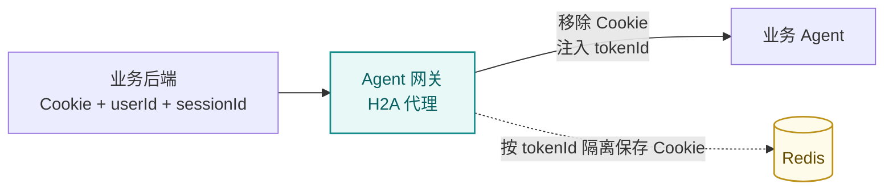
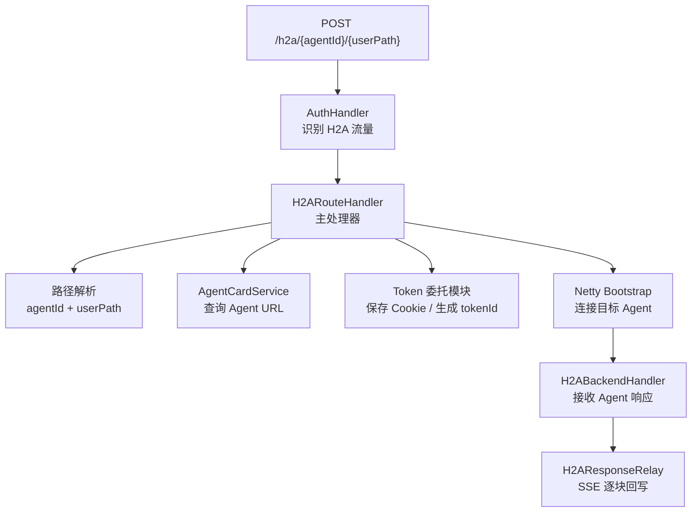
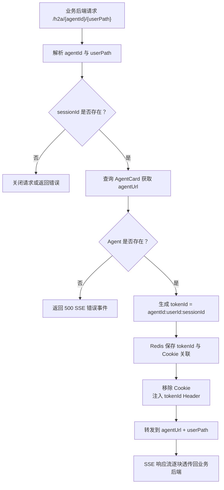
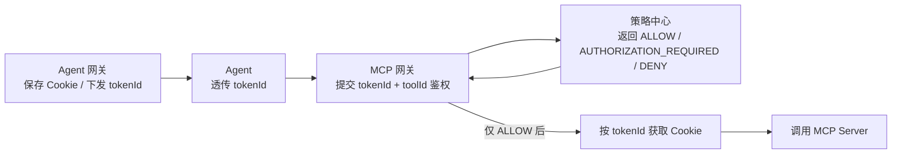

# Agent 网关方案设计（DRB 评审）

> 状态：CTO/DRB 评审材料
> 负责人：项目维护者
> 适用版本：V1
> 最后更新：2026-06-16
> 阅读顺序：07-02
> 文档职责：从黑盒到白盒说明 Agent 网关在动态授权安全方案中的代理、路由、Cookie 隔离和 tokenId 注入设计。

## 1. 黑盒视角

Agent 网关负责把所有业务后端到 Agent 的流量收口到统一入口：

```http
POST /h2a/{agentId}/{userPath}
```

输入侧：

- 业务后端请求目标 Agent。
- 请求携带用户上下文、会话上下文和 Cookie。

输出侧：

- Agent 网关把请求转发给目标 Agent。
- 转发时移除 Cookie，注入 `tokenId`。
- Agent 只感知 `tokenId`，不能直接拿到用户 Cookie。



Agent 网关不做 MCP 工具授权决策。工具是否可调用由 MCP 网关请求策略中心后决定。

## 2. 在整体安全方案中的定位

| 模块 | 核心问题 | Agent 网关参与方式 |
| --- | --- | --- |
| 后端到 Agent | 请求应该路由到哪个 Agent | 根据 `agentId` 查询 AgentCard 并动态路由 |
| Cookie 安全 | Agent 是否能看到 Cookie | 入站保存 Cookie，出站移除 Cookie |
| 授权上下文 | 下游如何识别用户和会话 | 生成并注入 `tokenId` |
| MCP 工具鉴权 | Agent 调工具是否允许 | 不参与决策，由 MCP 网关和策略中心完成 |
| 流式体验 | Agent SSE 响应如何回到业务后端 | Netty 长连接逐块透传 |

## 3. 白盒组件设计

### 3.1 Netty Pipeline

```text
HttpServerCodec
 -> HttpObjectAggregator
 -> AuthHandler
 -> H2ARouteHandler
 -> AdapterHandler
 -> MsgRouteHandler
```

`/h2a/` 请求由 `AuthHandler` 放行，进入 `H2ARouteHandler` 后完成路径解析、Agent 路由、tokenId 生成、Cookie 隔离和出站代理。

### 3.2 组件关系



## 4. 请求处理流程



路径解析规则：

```text
^/h2a/([^/]+)(/.*)?$
```

转发目标：

```text
agentUrl 去尾斜杠 + userPath
```

## 5. tokenId 与 Cookie 设计

当前 Agent 网关生成：

```text
tokenId = agentId:userId:sessionId
```

策略中心文档中第三段通常称为 `conversationId`。在当前安全方案中，`sessionId` 和 `conversationId` 都表示“业务后端维护的本次会话或对话上下文”。后续如果统一命名，接口语义应保持不变。

Redis 中保存的委托信息示例：

```json
{
  "tokenId": "agent-a:user-42:session-99",
  "cookie": "IDaaS_SSO=xxx",
  "issueTime": "2026-06-16T10:00:00Z",
  "expiryTime": "2026-06-16T11:00:00Z"
}
```

Header 变换：

| 阶段 | Cookie | userId | sessionId | tokenId |
| --- | --- | --- | --- | --- |
| 业务后端入站 | 存在 | 存在 | 存在 | 不需要 |
| 转发给 Agent | 移除 | 可保留 | 可保留 | 注入 |

安全意义：

- Agent 不接触 Cookie。
- `tokenId` 只作为 Cookie 和授权上下文的引用。
- MCP 网关只有在策略中心返回 `ALLOW` 后，才可以按 `tokenId` 获取关联 Cookie 并注入 MCP Server 调用。

## 6. 动态路由

Agent 网关通过 `AgentCardService.getAgentCardById(agentId)` 获取目标 Agent URL。

| 场景 | 行为 |
| --- | --- |
| Agent 存在且 URL 有效 | 转发到 `agentUrl + userPath` |
| Agent 不存在 | 返回 HTTP 500 + SSE 格式错误事件 |
| Agent URL 为空 | 返回 HTTP 500 + SSE 格式错误事件 |
| Agent URL 为 HTTPS | 出站链路自动注入 `SslContext` |

`AgentCardService` 可使用本地缓存降低管理面查询压力；缓存一致性由 Agent 网关内部策略控制。

## 7. SSE 流式透传

H2A 代理面向 Chat 场景，必须保持 Agent 的流式体验。

| 组件 | 职责 |
| --- | --- |
| `H2ABackendHandler` | 接收目标 Agent 返回的 `HttpResponse` 和 `HttpContent` |
| `H2AResponseRelay` | 将响应头和内容逐块写回客户端 Channel |

透传规则：

- SSE 事件字段完整保留。
- 首次收到响应时回写响应头。
- 后续 `HttpContent` 逐块转发。
- 收到 `LastHttpContent` 时关闭出站连接并结束客户端响应。
- 过滤 `Connection`、`Transfer-Encoding`、`Keep-Alive`、`Proxy-Connection` 等 Hop-by-hop Header。
- 异常时返回错误并关闭连接。

## 8. 策略通知与安全边界

Agent 网关可以向策略模块发送委托事件通知，例如 `agentId + cookie`。该通知用于辅助策略上下文或兼容旧流程：

- 异步执行。
- 不阻塞 H2A 主流程。
- 通知失败只记录 WARN。

安全边界：

- Agent 网关不做 MCP 工具授权决策。
- Agent 网关不判断 `toolId` 是否绑定。
- Agent 网关不维护用户对具体工具的授权记录。
- 策略中心不保存 Cookie。

## 9. 与 MCP 网关的协作



在当前安全方案里，业务 Agent 不应直接调用 Cookie 查询接口。Cookie 查询能力应由受控组件在授权通过后使用，典型调用方是 MCP 网关。

## 10. 异常处理

| 场景 | 行为 | 说明 |
| --- | --- | --- |
| 缺少 `sessionId` | 关闭请求或返回错误 | 无法生成稳定 tokenId |
| 缺少 `userId` | 返回错误 | 无法形成用户授权上下文 |
| Agent 不存在 | HTTP 500 + SSE 错误事件 | 明确为服务端配置问题 |
| Agent URL 为空 | HTTP 500 + SSE 错误事件 | 不转发到未知目标 |
| Redis 异常 | 请求失败或降级策略待定 | 不应让 Agent 获取 Cookie |
| 出站连接失败 | 关闭客户端连接并记录日志 | Agent 不可达 |
| 策略通知失败 | WARN 日志，不阻塞 | 通知不属于主链强依赖 |

## 11. 关键设计取舍

| 取舍 | 当前选择 | 原因 |
| --- | --- | --- |
| 路径前缀 | `/h2a/` | 明确 Human-to-Agent 流量，与 A2A 隔离 |
| tokenId 形态 | 明文三段拼接 | V1 简单可解析，便于策略中心直接使用 |
| Cookie 处理 | Redis 隔离保存，转发移除 | 降低 Agent 凭证暴露风险 |
| 工具授权位置 | 不在 Agent 网关判断 | 工具调用发生在 MCP 链路，最终门禁应在 MCP 网关 |
| 策略通知 | 异步不阻塞 | 避免非主链通知影响 Chat 请求体验 |
| SSE 代理 | Netty 逐块透传 | 保持流式响应和低延迟 |

## 12. 当前边界与演进

V1 当前边界：

- H2A 代理负责后端到 Agent 的统一入口。
- tokenId 采用 `agentId:userId:sessionId`。
- Cookie 隔离保存在 Redis。
- Agent 网关不参与工具授权决策。
- 策略通知失败不影响主流程。

未来演进方向：

- `sessionId` 与策略中心 `conversationId` 命名统一。
- 不透明随机 tokenId，由 Agent 网关向策略中心注册上下文。
- Cookie 查询接口增加更严格的调用方认证和授权。
- 代理日志接入统一链路追踪平台。
- AgentCard 缓存刷新和发布态一致性增强。

## 13. 相关文档

- [Agent 动态授权安全整体方案](00-agent-security-overall-solution.md)
- [Agent 网关 H2A 代理设计](../06-agent-gateway/01-agent-gateway-project-overall-architecture.md)
- [Agent 网关 API 参考](../06-agent-gateway/02-agent-gateway-api-reference.md)
- [项目总体架构](../01-architecture/01-project-overall-architecture.md)
- [策略中心方案设计](01-policy-center-solution-design.md)
- [开发人员详细接入文档](../05-integration/02-developer-integration-api-guide.md)
