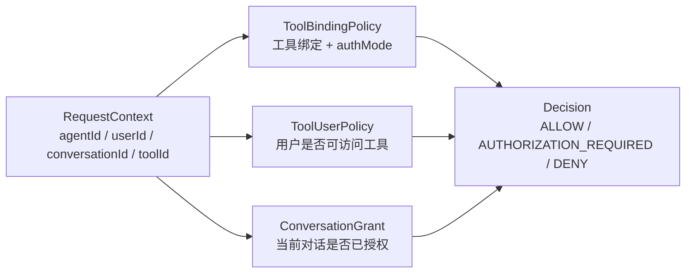
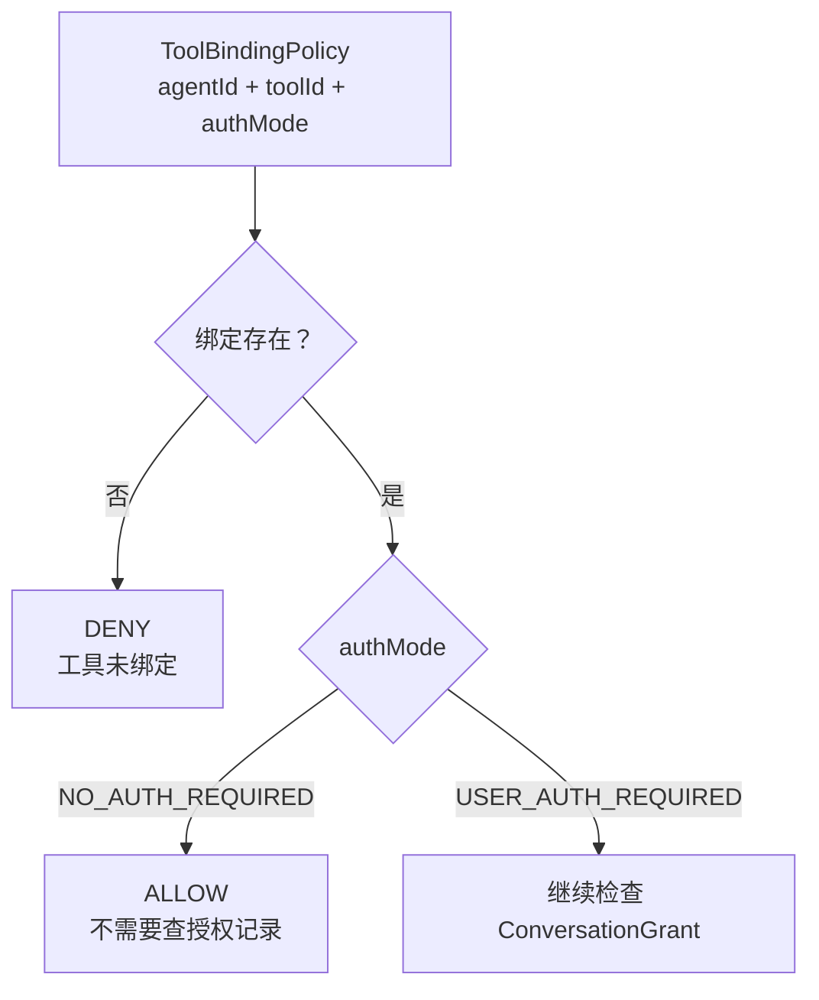
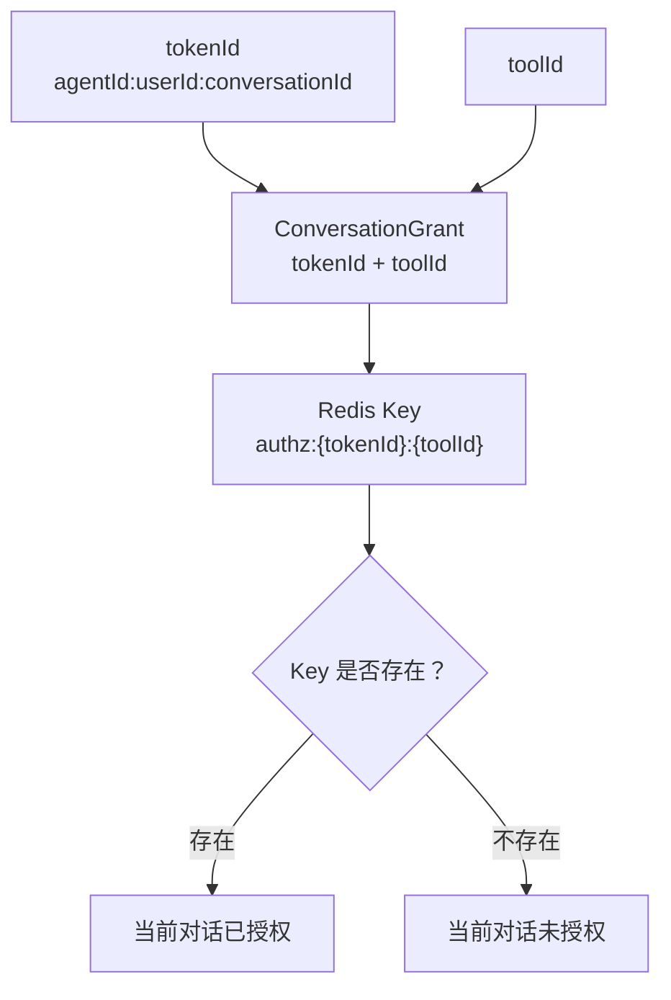
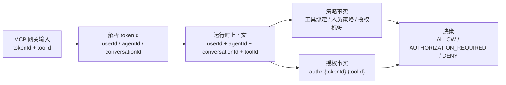
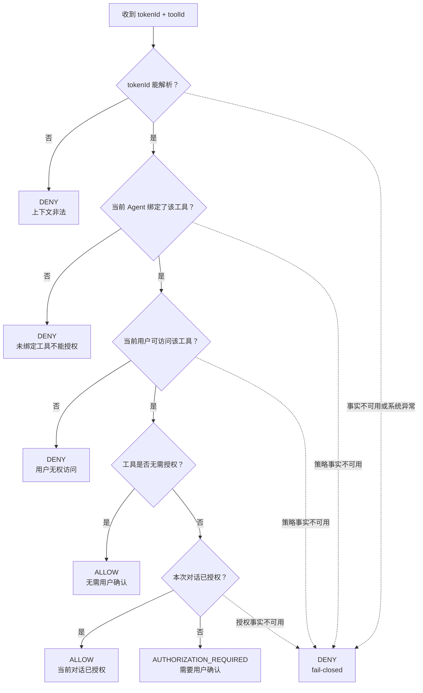
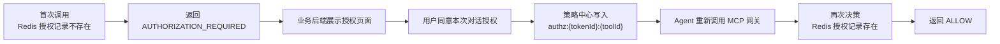

# 策略中心决策模型

> 状态：方案讲解材料
> 负责人：项目维护者
> 适用版本：V1
> 最后更新：2026-06-16
> 阅读顺序：07-03
> 文档职责：只说明 MCP 网关调用策略中心决策接口时，策略中心内部如何根据模型得到 `ALLOW / AUTHORIZATION_REQUIRED / DENY`。

## 1. 核心对象建模

策略中心内部可以先理解为 4 个核心对象。后面的决策树，本质上就是围绕这 4 个对象做判断。

| 对象 | 由什么构成 | 解决什么判断 | 来自哪里 |
| --- | --- | --- | --- |
| `RequestContext` | `tokenId + toolId`，解析后得到 `agentId + userId + conversationId + toolId` | 这次是谁、通过哪个 Agent、在哪次对话、想调用哪个工具 | MCP 网关请求 |
| `ToolBindingPolicy` | `agentId + toolId + authMode` | 工具是否绑定当前 Agent，以及工具标签是什么 | 管理面配置 |
| `ToolUserPolicy` | `agentId + toolId + accessScope + userId` | 当前用户是否可访问该工具 | 管理面配置 |
| `ConversationGrant` | `tokenId + toolId` | 当前对话是否已经授权该工具 | 用户确认后写入 |

### 1.1 核心对象关系图



`RequestContext` 是一次工具调用带来的上下文；另外三个对象是策略中心已经掌握的事实。策略中心把它们组合起来，得到最终决策。

### 1.2 工具标签建模图

`ToolBindingPolicy` 里最重要的是 `authMode`。它决定人员策略通过之后，是否还要继续查询授权记录。



工具标签模型决定是否需要查授权记录：

- `NO_AUTH_REQUIRED` 表示工具已绑定且无需用户确认。
- `USER_AUTH_REQUIRED` 表示工具已绑定，但还要看当前对话是否已经授权。

### 1.3 授权记录建模图

`ConversationGrant` 表示“本次对话是否已经允许调用这个工具”。它只对当前对话生效。



授权记录模型只对当前对话生效：

- 相同用户、相同 Agent，但不同 `conversationId`，不会共享授权记录。
- 相同 `tokenId`，不同 `toolId`，也不会共享授权记录。
- 授权记录不存在时，策略中心不能把它解释成允许。

## 2. 策略中心掌握哪两类事实

策略中心内部不是凭感觉判断，而是组合两类事实。

| 事实 | 存储 | 作用 |
| --- | --- | --- |
| 策略事实 | MySQL | 判断工具是否绑定、用户是否可访问、工具是否需要授权 |
| 授权事实 | Redis | 判断本次对话是否已经被用户确认授权 |

策略事实包括：

- 当前 Agent 是否绑定了这个工具。
- 当前用户是否能访问这个工具。
- 这个工具是无需授权，还是需要用户授权。

授权事实只有一个核心问题：

```text
Redis 中是否存在 authz:{tokenId}:{toolId}
```

存在表示本次对话已经授权；不存在表示本次对话还没有授权。

## 3. 内部决策模型图

### 3.1 输入到决策模型



策略中心能决策，是因为它把“运行时上下文”与“已配置策略”和“当前对话授权记录”放到同一个模型里判断。

### 3.2 决策树



这棵树有两个关键点：

- 未绑定工具直接 `DENY`，不能进入授权页面。
- 只有 `AUTHORIZATION_REQUIRED` 才进入人在回路授权。

### 3.3 人在回路前后变化



人在回路改变的不是工具策略，而是为当前对话增加了一条授权事实。授权写入后，Agent 仍然必须重新经过 MCP 网关和策略中心，不能直接执行工具。

## 4. 三种决策结果代表什么

| 决策 | 什么时候返回 | MCP 网关应做什么 |
| --- | --- | --- |
| `ALLOW` | 工具无需授权，或当前对话已经授权 | 继续获取 Cookie 并调用 MCP Server |
| `AUTHORIZATION_REQUIRED` | 工具已绑定、用户可访问、但当前对话未授权 | 返回未授权信息，让 Agent 进入人在回路 |
| `DENY` | tokenId 非法、工具未绑定、用户无权访问、事实不可用或系统异常 | 终止调用，不获取 Cookie，不调用 MCP Server |

策略中心不保存 Cookie，不调用 MCP Server，不生成 tokenId。它只根据策略事实和授权事实输出决策。

异常或事实不可用时统一 fail-closed：策略中心不能证明允许时，就返回拒绝，避免异常链路绕过安全控制。

## 相关文档

- [权限策略中心方案设计](01-policy-center-solution-design.md)
- [策略中心功能规格](../02-policy-center/01-policy-center-spec.md)
- [策略中心 API 契约](../02-policy-center/02-api-contract.md)
- [策略中心数据模型](../02-policy-center/03-data-model.md)
