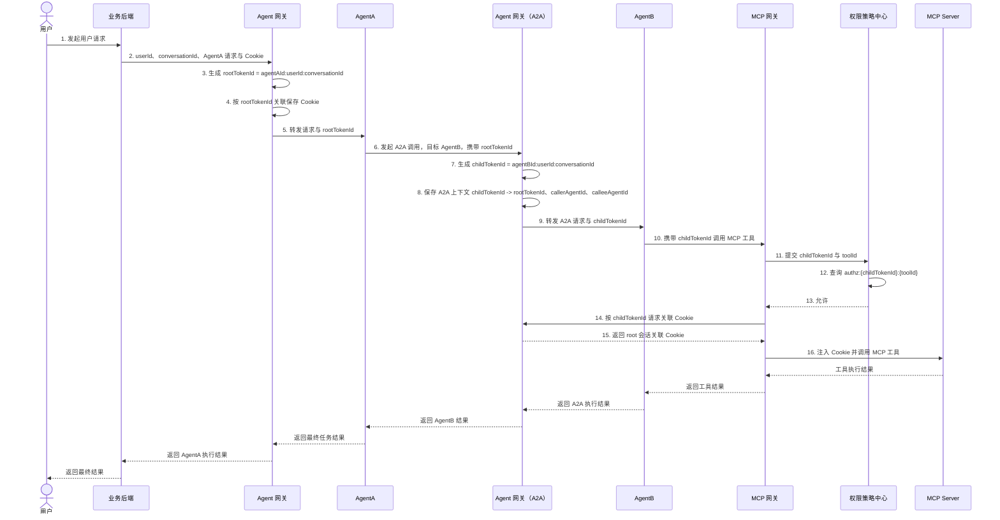
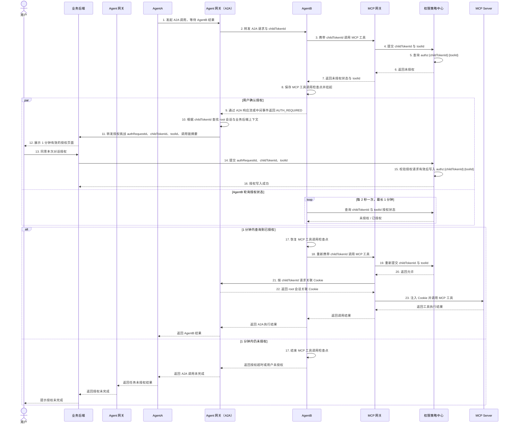

# A2A 授权委托设计

> 文档定位：基于 [Agent 动态授权项目总体架构](project-overall-architecture.md) 的 A2A 场景扩展设计。
> 关注范围：`人 -> Web 后端 -> Agent 网关 -> AgentA -> Agent 网关（A2A） -> AgentB -> MCP 工具` 链路中的子 token 生成、授权挑战回传、人在回路确认和检查点恢复。
> 基线约束：本方案不改变总体架构中的 `tokenId = agentId:userId:conversationId` 格式，不改变 MCP 网关与策略中心的 `tokenId + toolId` 授权检查模型。

## 设计定位与基线约束

现有总体架构只覆盖用户直接访问单个 Agent 后，由该 Agent 调用 MCP 工具的非 A2A 场景。A2A 场景中，AgentA 不直接调用 AgentB，而是通过 Agent 网关的 A2A 代理入口调用 AgentB；AgentB 再根据自己的任务规划调用 MCP 工具。

本设计只补充 A2A 链路中的授权上下文传递与授权挑战回传机制，不引入跨对话授权、长期委托、用户预配置 A2A 控制策略、多级长期委托策略或新的 Token 生命周期模型。

核心原则如下：

- A2A 调用本身不触发用户人在回路授权。Agent 网关（A2A）只做必要的 Agent 注册状态、A2A 路由入口和调用上下文维护。
- 只有 AgentB 规划并调用 MCP 工具时发现 `childTokenId + toolId` 未授权，才触发用户人在回路确认。
- AgentB 只接收自己的子 token，不接触 Cookie、业务后端会话、浏览器上下文或 AgentA 的 root token。
- MCP 网关仍只向策略中心提交 `tokenId + toolId`，不需要理解完整 A2A 编排。
- 策略中心仍以 `authz:{tokenId}:{toolId}` 作为本次对话工具授权记录；A2A 场景中写入的是 AgentB 子 token 对应的授权记录。

## A2A 正常调用链路



正常链路中，Agent 网关（A2A）是 AgentA 与 AgentB 之间的唯一 A2A 代理入口。它可以是 Agent 网关服务中的独立 A2A 入口或逻辑模块，但在链路上必须体现为 `AgentA -> Agent 网关（A2A） -> AgentB`。AgentA 不直接访问 AgentB 的真实地址，AgentB 也不需要知道用户请求来自哪个业务后端页面。AgentB 调 MCP 工具时只携带 `childTokenId`，后续授权检查、Cookie 换取和审计都围绕该子 token 展开。

## AgentB 工具缺权时的人在回路授权链路



该链路中存在两个等待点，但职责不同：

- AgentA 在 A2A 调用点等待 AgentB 的最终结果，类似等待一个耗时的下游能力返回。
- AgentB 在 MCP 工具调用点保存检查点、轮询授权状态并负责恢复执行。

AgentA 不负责轮询 AgentB 的工具授权，也不负责重新调度 AgentB 的 MCP 工具调用。缺哪个 Agent 的工具权限，就由哪个 Agent 保存并恢复自己的工具调用检查点。

## A2A 子 token 与上下文模型

### 子 token

A2A 场景中，Agent 网关（A2A）为被调用方 AgentB 生成独立子 token：

```text
childTokenId = agentBId:userId:conversationId
```

字段规则与总体架构中的 tokenId 完全一致：

- `agentBId` 由 Agent 网关（A2A）根据目标 Agent 注册信息确定，并且必须全局唯一。
- `userId` 和 `conversationId` 继承自 root 会话。
- 三个字段必须非空，并且禁止包含分隔符 `:`。
- `childTokenId` 仍只是授权关联标识，不是加密、签名或防篡改安全 Token。

AgentB 使用 `childTokenId` 调用 MCP。MCP 网关和策略中心不需要知道该 token 是否来自 A2A，只需按既有协议执行 `tokenId + toolId` 授权检查。

### Agent 网关（A2A）内部上下文

Agent 网关（A2A）需要维护子 token 与 root 会话之间的受控关联，建议内部上下文包含：

```json
{
  "childTokenId": "agentBId:userId:conversationId",
  "rootTokenId": "agentAId:userId:conversationId",
  "parentTokenId": "agentAId:userId:conversationId",
  "userId": "userId",
  "conversationId": "conversationId",
  "callerAgentId": "agentAId",
  "calleeAgentId": "agentBId",
  "backendSessionRef": "opaque-backend-session-ref",
  "createdAt": "2026-06-09T10:00:00+08:00",
  "expiresWithConversation": true
}
```

说明：

- `backendSessionRef` 是 Agent 网关（A2A）内部用于回到业务后端授权会话的引用，不传递给 AgentA 或 AgentB。
- `childTokenId` 换取 Cookie 时，Agent 网关（A2A）应通过该上下文定位 root 会话保存的 Cookie。
- 对话结束或删除时，业务后端应通知 Agent 网关、Agent 网关（A2A）和策略中心清理 root token、所有 child token、A2A 上下文及对应授权记录。
- 当前版本不要求策略中心解析完整 A2A 上下文；策略中心只需要保存授权请求、授权写入和审计所需的 A2A 摘要字段。

## AUTH_REQUIRED 事件字段建议

AgentB 发现工具未授权后，通过 A2A 响应流或中间事件向 Agent 网关（A2A）返回标准化授权挑战。建议事件字段如下：

```json
{
  "eventType": "AUTH_REQUIRED",
  "authRequestId": "auth-request-id",
  "tokenId": "agentBId:userId:conversationId",
  "toolId": "tool-id",
  "callerAgentId": "agentAId",
  "calleeAgentId": "agentBId",
  "conversationId": "conversationId",
  "reason": "MCP_TOOL_NOT_AUTHORIZED",
  "expiresInSeconds": 60
}
```

字段边界：

- `tokenId` 必须是 AgentB 的 `childTokenId`，不得使用 AgentA 的 `rootTokenId`。
- `authRequestId` 由 Agent 网关（A2A）生成或确认，用于绑定 1 分钟有效的授权会话，防止重复提交或越权提交。
- `callerAgentId` 和 `calleeAgentId` 只用于页面展示和审计，不作为 MCP 网关放行依据。
- 事件中不得包含 Cookie、业务系统原始凭证、用户隐私数据或可直接访问业务后端会话的引用。

业务后端展示授权页面时，应让用户看到本次请求来自当前对话，并说明 AgentA 委托 AgentB 执行任务，AgentB 请求调用目标工具 `toolId`。页面确认后仍只代表本次对话内对 `childTokenId + toolId` 的授权。

## 组件职责边界

| 组件 | A2A 场景新增职责 | 不应承担的职责 |
| --- | --- | --- |
| 业务后端 | 接收 Agent 网关（A2A）转发的授权挑战，展示用户授权页面，确认后向策略中心提交 `authRequestId + childTokenId + toolId` | 生成子 token、直接调用 AgentB、保存 Cookie 到 Agent 侧 |
| Agent 网关 | 承接 Web 后端请求，生成 AgentA 的 `rootTokenId`，保存 root 会话 Cookie，向 AgentA 转发用户请求 | 动态工具授权决策、直接转发 AgentA 到 AgentB 的 A2A 请求 |
| Agent 网关（A2A） | 承接 AgentA 的 A2A 调用，生成 AgentB 的 `childTokenId`，维护 `childTokenId -> rootTokenId` 上下文，转发 `AUTH_REQUIRED`，按 childTokenId 为 MCP 网关换取 root 会话 Cookie | 动态工具授权决策、替 AgentB 轮询工具授权状态、把 Cookie 传给 Agent |
| AgentA | 根据任务需要通过 Agent 网关（A2A）发起 A2A 调用并等待 AgentB 结果 | 直接访问 AgentB 真实地址、处理 AgentB 的 MCP 工具授权恢复、接触 Cookie |
| AgentB | 使用 `childTokenId` 执行任务和调用 MCP，未授权时保存检查点、发出 `AUTH_REQUIRED`、轮询授权状态并恢复工具调用 | 使用 AgentA 的 root token、访问业务后端会话、接触 Cookie 或长期凭证 |
| MCP 网关 | 继续接收 `tokenId + toolId`，授权允许后按 tokenId 向 Agent 网关（A2A）换取 Cookie 并注入工具调用 | 解析完整 A2A 调用链、在授权前获取 Cookie、长期保存 Cookie |
| 权限策略中心 | 继续检查 `authz:{tokenId}:{toolId}`，校验授权请求有效性，写入 `authz:{childTokenId}:{toolId}`，记录 A2A 审计字段 | 生成 tokenId、调用 MCP 工具、管理 Agent 路由 |
| MCP Server | 按 MCP 网关注入的受控上下文访问业务 API | 判断 A2A 委托关系、绕过 MCP 网关访问 Cookie |

## 安全约束与默认拒绝规则

- A2A 子 token 不得扩大权限。AgentB 调用工具必须使用自己的 `childTokenId` 单独授权，不得复用 AgentA 的 `rootTokenId` 授权记录。
- MCP 网关收到策略中心拒绝、超时或异常时必须拒绝调用，不得向 Agent 网关（A2A）换取 Cookie。
- Agent 网关（A2A）只有在 MCP 网关携带已获允许的 `childTokenId` 请求 Cookie 时，才可通过 A2A 上下文定位 root 会话 Cookie。
- `AUTH_REQUIRED` 只是一种授权挑战事件，不代表授权已经获得。AgentB 必须在用户确认并由策略中心写入授权记录后，重新调用 MCP 网关。
- 授权页面和服务端授权请求仍只在 1 分钟内有效，超时后业务后端和策略中心均应拒绝提交。
- 对话结束、删除或 root 会话失效时，必须同时清理 root token、所有 child token、Agent 网关（A2A）上下文和 `authz:{childTokenId}:*` 授权记录。
- AgentA 与 AgentB 均不得解析 tokenId 来自行判断权限；权限判断只能由 MCP 网关提交策略中心完成。
- 所有关键事件必须审计，包括子 token 生成、A2A 路由、`AUTH_REQUIRED` 产生、授权页展示、用户确认、授权写入、轮询结果、MCP 允许或拒绝、Cookie 换取和对话清理。

## 审计字段建议

A2A 审计事件应在现有 `tokenId / 决策 / 工具调用` 审计链路上补充调用关系字段：

```json
{
  "eventType": "A2A_AUTH_REQUIRED",
  "rootTokenId": "agentAId:userId:conversationId",
  "childTokenId": "agentBId:userId:conversationId",
  "userId": "userId",
  "conversationId": "conversationId",
  "callerAgentId": "agentAId",
  "calleeAgentId": "agentBId",
  "toolId": "tool-id",
  "authRequestId": "auth-request-id",
  "decision": "UNAUTHORIZED",
  "createdAt": "2026-06-09T10:00:00+08:00"
}
```

建议覆盖以下事件类型：

- `A2A_CHILD_TOKEN_CREATED`
- `A2A_ROUTE_STARTED`
- `A2A_AUTH_REQUIRED`
- `A2A_AUTH_GRANTED`
- `A2A_AUTH_TIMEOUT`
- `A2A_TOOL_ALLOWED`
- `A2A_TOOL_DENIED`
- `A2A_CONTEXT_CLEARED`

审计日志中的调用链字段只用于追踪和排障，不改变策略中心的授权检查输入。策略中心的在线决策仍以 `tokenId + toolId` 为准。

## 验收场景

1. **A2A 正常调用成功**
   - 用户请求进入 AgentA。
   - AgentA 通过 Agent 网关（A2A）调用 AgentB。
   - Agent 网关（A2A）为 AgentB 生成 `childTokenId = agentBId:userId:conversationId`。
   - AgentB 使用 `childTokenId` 调用 MCP。

2. **AgentB 工具已授权**
   - Redis 中存在 `authz:{childTokenId}:{toolId}`。
   - MCP 网关提交 `childTokenId + toolId` 后获得允许。
   - MCP 网关按 `childTokenId` 向 Agent 网关（A2A）换取 root 会话 Cookie，并完成工具调用。

3. **AgentB 工具未授权后用户确认**
   - Redis 中不存在 `authz:{childTokenId}:{toolId}`。
   - AgentB 保存 MCP 工具调用检查点并发出 `AUTH_REQUIRED`。
   - Agent 网关（A2A）把授权挑战转发给业务后端。
   - 用户在 1 分钟内确认后，策略中心写入 `authz:{childTokenId}:{toolId}`。
   - AgentB 轮询到已授权，恢复检查点并重新调用 MCP 成功。

4. **用户未在 1 分钟内确认**
   - AgentB 轮询超时并结束检查点。
   - AgentA 收到 A2A 调用未完成结果。
   - 业务后端提示授权未完成。
   - 策略中心不得写入过期授权记录。

5. **AgentB 不得复用 AgentA 授权**
   - 仅存在 `authz:{rootTokenId}:{toolId}`，不存在 `authz:{childTokenId}:{toolId}`。
   - AgentB 使用 `childTokenId` 调 MCP 时必须被判定为未授权。

6. **拒绝或异常时不得换取 Cookie**
   - 策略中心返回拒绝、超时或不可用。
   - MCP 网关不得向 Agent 网关（A2A）请求 Cookie。
   - Agent 网关和 Agent 网关（A2A）不得向 AgentA 或 AgentB 返回 Cookie。

7. **对话结束清理**
   - 业务后端结束或删除对话。
   - root token、所有 child token、A2A 上下文和对应授权记录均被清理。
   - 清理后再次使用旧 `childTokenId` 调 MCP 必须失败。


