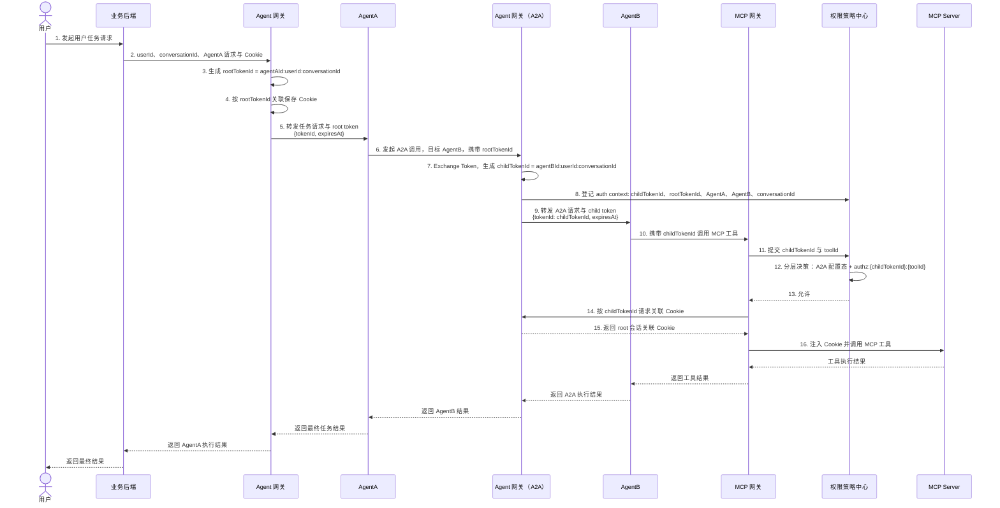
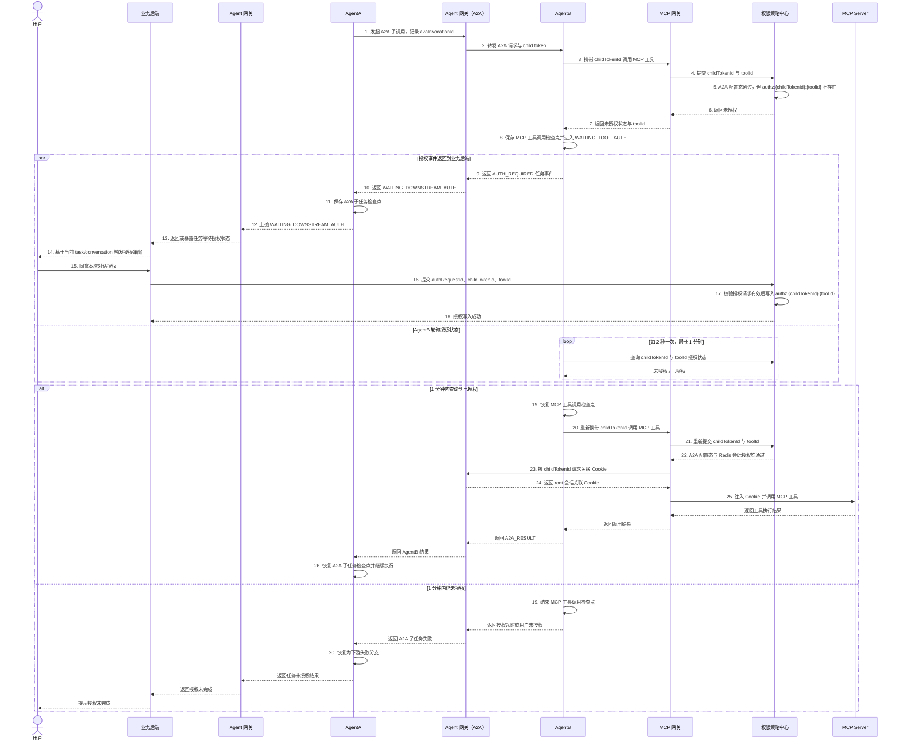

# A2A 授权委托设计

> 文档定位：基于 [Agent 动态授权项目总体架构](project-overall-architecture.md) 的 A2A 场景扩展设计。
> 关注范围：`人 -> Web 后端 -> Agent 网关 -> AgentA -> Agent 网关（A2A） -> AgentB -> MCP 工具` 链路中的 token exchange、最小 token、服务端授权上下文、策略中心分层决策、人在回路授权事件和检查点恢复。
> 基线约束：本方案不改变总体架构中的 `tokenId = agentId:userId:conversationId` 格式，不改变 MCP 网关与策略中心的 `tokenId + toolId` 授权检查模型，不改变 Redis 授权记录 `authz:{tokenId}:{toolId}` 的结构。

## 设计定位与核心原则

现有总体架构覆盖用户直接访问单个 Agent 后，由该 Agent 调用 MCP 工具的非 A2A 场景。A2A 场景中，AgentA 不直接调用 AgentB，而是通过 Agent 网关的 A2A 代理入口调用 AgentB；AgentB 再根据自己的任务规划调用 MCP 工具。

本设计只补充 A2A 链路中的 token exchange、授权上下文登记、授权挑战回传和检查点恢复机制，不引入跨对话授权、长期委托、多级长期委托策略或新的 Token 生命周期模型。

核心原则如下：

- A2A 通讯必须经过 Agent 网关（A2A），链路体现为 `AgentA -> Agent 网关（A2A） -> AgentB`。
- AgentA 调 AgentB 时需要执行 token exchange，由 Agent 网关（A2A）为 AgentB 生成子 token。
- 返回给 AgentB 的 token 必须尽量小，只包含 `tokenId` 和 `expiresAt`；A2A 链路、caller、callee、root token 等信息不放入 token。
- Agent 网关（A2A）在服务端登记 `authctx:{childTokenId}`，供策略中心做 A2A 决策和审计。
- Redis 授权记录不承载 A2A chain，只继续表达“当前 tokenId 在当前对话是否被用户授权调用 toolId”。
- 最终放行由策略中心在 AgentB 调 MCP 工具时计算：A2A 配置态允许，且 Redis 会话授权存在，两者取交集。
- 只有 AgentB 规划并调用 MCP 工具发现缺权时，才触发人在回路授权。
- 授权弹窗由业务后端触发；Agent 网关（A2A）不主动控制前端弹窗，只产生或暴露授权事件。
- AgentA 只处理“下游 AgentB 等待授权”的任务状态，不负责授权决策、不修改 toolId、不写授权记录。

## A2A 正常调用链路



正常链路中，Agent 网关（A2A）是 AgentA 与 AgentB 之间的唯一 A2A 代理入口。它可以是 Agent 网关服务中的独立 A2A 入口或逻辑模块，但在链路上必须体现为 `AgentA -> Agent 网关（A2A） -> AgentB`。AgentA 不直接访问 AgentB 的真实地址，AgentB 也不需要知道用户请求来自哪个业务后端页面。

## 最小 Token 与服务端 Auth Context

### Agent 侧最小 token

AgentA 和 AgentB 接收的 token 均保持最小化，只包含运行时引用和过期时间：

```json
{
  "tokenId": "agentBId:userId:conversationId",
  "expiresAt": "2026-06-09T10:01:00+08:00"
}
```

规则如下：

- `tokenId` 格式仍沿用总体架构：`agentId:userId:conversationId`。
- A2A 场景下，AgentB 获得的是 `childTokenId = agentBId:userId:conversationId`。
- token 中不携带 `agentChain`、`callerAgentId`、`rootTokenId`、工具范围、Cookie 或业务后端会话引用。
- token 只是授权关联标识，不是 Agent 自行声明权限的载体。

### 服务端 auth context

Agent 网关（A2A）完成 exchange token 后，向策略中心登记服务端 auth context。建议逻辑记录如下：

```json
{
  "tokenId": "agentBId:userId:conversationId",
  "tokenType": "A2A_CHILD",
  "rootTokenId": "agentAId:userId:conversationId",
  "callerAgentId": "agentAId",
  "currentAgentId": "agentBId",
  "userId": "userId",
  "conversationId": "conversationId",
  "agentChain": ["agentAId", "agentBId"],
  "expiresAt": "2026-06-09T10:01:00+08:00"
}
```

职责边界如下：

- `authctx:{tokenId}` 存在于服务端，由 Agent 网关（A2A）登记，由策略中心读取。
- AgentA 和 AgentB 不接收完整 auth context，也不得自行声明或修改 agent chain。
- 策略中心需要 A2A 上下文时，通过 `tokenId` 查询 auth context，而不是从 Redis 授权 key 中解析 chain。
- 审计日志可以记录 agent chain，但 Redis 授权记录仍保持 `authz:{tokenId}:{toolId}`。

### Redis 授权记录

A2A 场景不改变 Redis 授权结构：

```text
authz:{childTokenId}:{toolId}
```

该记录只表示：当前用户在当前对话中，已经授权 AgentB 使用 `childTokenId` 调用目标 `toolId`。它不表达 AgentA、AgentB 的委托关系，也不表达完整 A2A chain。

## 策略中心分层决策

AgentB 调 MCP 工具时，MCP 网关仍只提交：

```json
{
  "tokenId": "agentBId:userId:conversationId",
  "toolId": "tool-id"
}
```

策略中心内部执行分层决策：

```text
最终允许 =
  token 未过期
  AND auth context 存在
  AND A2A 配置态允许 callerAgentId -> currentAgentId 针对当前 toolId/tag 的委托
  AND Redis 存在 authz:{tokenId}:{toolId}
```

A2A 配置态可以表达 Agent 之间的系统级安全边界，例如：

```json
{
  "callerAgentId": "agentAId",
  "calleeAgentId": "agentBId",
  "enabled": true,
  "allowedToolTags": ["READ", "QUERY"],
  "deniedToolTags": ["DELETE", "HIGH_RISK"],
  "status": "ACTIVE"
}
```

设计要点：

- A2A 配置态不是在 A2A 路由阶段一次性最终放行，而是在 AgentB 调用具体 MCP 工具时参与策略中心决策。
- 因为只有 AgentB 规划出 `toolId` 后，策略中心才知道本次 A2A 委托实际触达的工具和标签。
- A2A 配置态解决“AgentA 是否允许委托 AgentB 触达这类能力”。
- Redis 会话授权解决“用户是否在本次对话中确认 AgentB 调用这个具体工具”。
- 两者任一不满足，策略中心均返回拒绝。

## AgentB 工具缺权时的人在回路授权链路

授权弹窗由业务后端触发。Agent 网关（A2A）不主动调用业务后端要求它弹窗，而是将 `AUTH_REQUIRED` 作为任务事件沿 A2A/Agent 调用链返回，或供业务后端按 `taskId` / `conversationId` 订阅、轮询。



该链路中有两个检查点：

| 检查点 | 保存者 | 等待对象 | 恢复者 |
| --- | --- | --- | --- |
| MCP 工具调用检查点 | AgentB | 用户授权 `childTokenId + toolId` | AgentB |
| A2A 子任务检查点 | AgentA | AgentB 返回最终结果 | AgentA |

AgentA 不处理 AgentB 的授权，只处理 AgentB 子任务的生命周期。AgentA 收到 `WAITING_DOWNSTREAM_AUTH` 后，进入等待状态，向上游返回任务等待授权状态；授权成功后，AgentB 先恢复自己的 MCP 工具调用，完成后返回结果，AgentA 再恢复自己的 A2A 子任务检查点。

## AUTH_REQUIRED 事件字段建议

`AUTH_REQUIRED` 是任务事件，不是已授权结果。建议字段如下：

```json
{
  "eventType": "AUTH_REQUIRED",
  "taskId": "task-id",
  "conversationId": "conversationId",
  "a2aInvocationId": "a2a-invocation-id",
  "authRequestId": "auth-request-id",
  "tokenId": "agentBId:userId:conversationId",
  "toolId": "tool-id",
  "calleeAgentId": "agentBId",
  "reason": "MCP_TOOL_NOT_AUTHORIZED",
  "expiresInSeconds": 60
}
```

字段边界：

- `tokenId` 必须是 AgentB 的 `childTokenId`，不得使用 AgentA 的 `rootTokenId`。
- 事件中不携带 Cookie、业务系统原始凭证、完整 auth context 或可直接访问业务后端会话的引用。
- `authRequestId` 用于绑定 1 分钟有效的授权会话，防止重复提交或越权提交。
- AgentA 可以透传该事件或将其转换为 `WAITING_DOWNSTREAM_AUTH` 任务状态，但不得修改 `toolId`、不得写入授权记录。

## 组件职责边界

| 组件 | A2A 场景新增职责 | 不应承担的职责 |
| --- | --- | --- |
| 业务后端 | 接收 Agent 网关返回或暴露的 `AUTH_REQUIRED` / `WAITING_DOWNSTREAM_AUTH` 任务事件，触发前端授权弹窗，确认后向策略中心提交 `authRequestId + childTokenId + toolId` | 生成子 token、直接调用 AgentB、保存 Cookie 到 Agent 侧 |
| Agent 网关 | 承接 Web 后端请求，生成 AgentA 的 root token，保存 root 会话 Cookie，向 AgentA 转发用户任务，向业务后端返回任务状态事件 | 动态工具授权决策、直接转发 AgentA 到 AgentB 的 A2A 请求 |
| Agent 网关（A2A） | 承接 AgentA 的 A2A 调用，执行 exchange token，生成 AgentB 的最小 child token，登记服务端 auth context，转发 A2A 任务事件，按 childTokenId 为 MCP 网关换取 root 会话 Cookie | 动态工具授权决策、替 AgentB 轮询工具授权状态、把 Cookie 或完整 auth context 传给 Agent |
| AgentA | 通过 Agent 网关（A2A）发起 A2A 子调用，保存 A2A 子任务检查点，接收 `WAITING_DOWNSTREAM_AUTH`，等待 AgentB 最终结果 | 直接访问 AgentB 真实地址、处理 AgentB 的 MCP 工具授权恢复、修改 toolId、写授权记录、接触 Cookie |
| AgentB | 使用最小 child token 执行任务和调用 MCP，未授权时保存 MCP 工具检查点、发出 `AUTH_REQUIRED`、轮询授权状态并恢复工具调用 | 使用 AgentA 的 root token、访问业务后端会话、接触 Cookie 或长期凭证 |
| MCP 网关 | 继续接收 `tokenId + toolId`，授权允许后按 tokenId 向 Agent 网关（A2A）换取 Cookie 并注入工具调用 | 解析完整 A2A 调用链、在授权前获取 Cookie、长期保存 Cookie |
| 权限策略中心 | 保存 auth context，维护 A2A 配置态，检查 `tokenId + toolId`，将 A2A 配置态与 `authz:{tokenId}:{toolId}` 取交集，记录审计事件 | 生成 tokenId、调用 MCP 工具、管理 Agent 路由 |
| MCP Server | 按 MCP 网关注入的受控上下文访问业务 API | 判断 A2A 委托关系、绕过 MCP 网关访问 Cookie |

## 安全约束与默认拒绝规则

- AgentB 调 MCP 工具必须使用自己的 `childTokenId`，不得复用 AgentA 的 `rootTokenId` 授权记录。
- Agent 侧 token 只包含 `tokenId` 和 `expiresAt`，不得携带 Cookie、完整 agent chain、工具范围或业务后端会话引用。
- A2A chain 只存在于服务端 auth context 和审计事件中，不由 Agent 自行声明。
- 策略中心必须先读取 auth context 和 A2A 配置态，再检查 Redis 会话授权；两者任一不满足即拒绝。
- MCP 网关收到策略中心拒绝、超时或异常时必须拒绝调用，不得向 Agent 网关（A2A）换取 Cookie。
- Agent 网关（A2A）只有在 MCP 网关携带已获允许的 `childTokenId` 请求 Cookie 时，才可通过 auth context 定位 root 会话 Cookie。
- `AUTH_REQUIRED` 只是一种任务事件，不代表授权已经获得。AgentB 必须在用户确认并由策略中心写入授权记录后，重新调用 MCP 网关。
- 授权页面和服务端授权请求仍只在 1 分钟内有效，超时后业务后端和策略中心均应拒绝提交。
- 对话结束、删除或 root 会话失效时，必须同时清理 root token、所有 child token、auth context、A2A 上下文和 `authz:{childTokenId}:*` 授权记录。
- 所有关键事件必须审计，包括 token exchange、auth context 登记、A2A 路由、策略中心分层决策、`AUTH_REQUIRED`、用户确认、授权写入、轮询结果、MCP 允许或拒绝、Cookie 换取和对话清理。

## 审计字段建议

A2A 审计事件应在现有 `tokenId / 决策 / 工具调用` 审计链路上补充服务端上下文字段：

```json
{
  "eventType": "A2A_POLICY_DECISION",
  "rootTokenId": "agentAId:userId:conversationId",
  "childTokenId": "agentBId:userId:conversationId",
  "userId": "userId",
  "conversationId": "conversationId",
  "callerAgentId": "agentAId",
  "currentAgentId": "agentBId",
  "agentChain": ["agentAId", "agentBId"],
  "toolId": "tool-id",
  "a2aPolicyDecision": "ALLOW",
  "sessionGrantDecision": "ALLOW",
  "finalDecision": "ALLOW",
  "createdAt": "2026-06-09T10:00:00+08:00"
}
```

建议覆盖以下事件类型：

- `A2A_TOKEN_EXCHANGED`
- `A2A_AUTH_CONTEXT_REGISTERED`
- `A2A_ROUTE_STARTED`
- `A2A_POLICY_ALLOWED`
- `A2A_POLICY_DENIED`
- `A2A_AUTH_REQUIRED`
- `A2A_AUTH_GRANTED`
- `A2A_AUTH_TIMEOUT`
- `A2A_TOOL_ALLOWED`
- `A2A_TOOL_DENIED`
- `A2A_CONTEXT_CLEARED`

审计日志用于追踪和排障，不改变 Redis 授权结构。策略中心在线决策仍以 `tokenId + toolId` 为入口，但会通过 `tokenId` 查询服务端 auth context 和 A2A 配置态。

## 验收场景

1. **A2A exchange token 成功**
   - AgentA 通过 Agent 网关（A2A）调用 AgentB。
   - Agent 网关（A2A）生成 `childTokenId = agentBId:userId:conversationId`。
   - AgentB 只收到 `{tokenId, expiresAt}`。
   - 策略中心存在 `authctx:{childTokenId}`，记录 AgentA、AgentB、rootTokenId、conversationId 和 agentChain。

2. **AgentB 工具已授权且 A2A 配置态允许**
   - A2A 配置态允许 `AgentA -> AgentB` 访问目标 `toolId` 对应标签。
   - Redis 中存在 `authz:{childTokenId}:{toolId}`。
   - 策略中心返回允许。
   - MCP 网关按 `childTokenId` 向 Agent 网关（A2A）换取 root 会话 Cookie，并完成工具调用。

3. **A2A 配置态拒绝**
   - Redis 中存在 `authz:{childTokenId}:{toolId}`。
   - A2A 配置态不允许 `AgentA -> AgentB` 触达目标工具标签。
   - 策略中心必须返回拒绝，MCP 网关不得换取 Cookie。

4. **AgentB 工具未授权后用户确认**
   - A2A 配置态允许，但 Redis 中不存在 `authz:{childTokenId}:{toolId}`。
   - AgentB 保存 MCP 工具检查点并发出 `AUTH_REQUIRED`。
   - AgentA 进入 `WAITING_DOWNSTREAM_AUTH`，业务后端拿到任务事件后触发前端授权弹窗。
   - 用户在 1 分钟内确认后，策略中心写入 `authz:{childTokenId}:{toolId}`。
   - AgentB 轮询到已授权，恢复 MCP 工具检查点并重新调用 MCP 成功。
   - AgentA 收到 AgentB 结果后恢复 A2A 子任务检查点并继续执行。

5. **用户未在 1 分钟内确认**
   - AgentB 轮询超时并结束 MCP 工具检查点。
   - AgentA 收到 A2A 子任务失败，恢复为下游失败分支。
   - 业务后端提示授权未完成。
   - 策略中心不得写入过期授权记录。

6. **AgentB 不得复用 AgentA 授权**
   - 仅存在 `authz:{rootTokenId}:{toolId}`，不存在 `authz:{childTokenId}:{toolId}`。
   - AgentB 使用 `childTokenId` 调 MCP 时必须被判定为未授权。

7. **拒绝或异常时不得换取 Cookie**
   - 策略中心返回拒绝、超时或不可用。
   - MCP 网关不得向 Agent 网关（A2A）请求 Cookie。
   - Agent 网关和 Agent 网关（A2A）不得向 AgentA 或 AgentB 返回 Cookie。

8. **对话结束清理**
   - 业务后端结束或删除对话。
   - root token、所有 child token、auth context、A2A 上下文和对应授权记录均被清理。
   - 清理后再次使用旧 `childTokenId` 调 MCP 必须失败。

