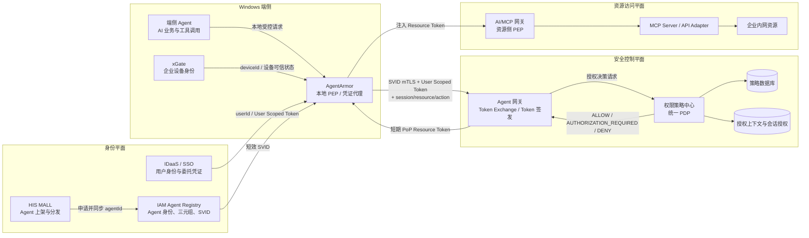
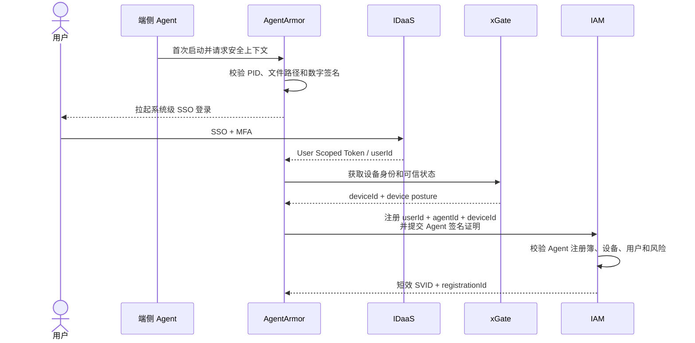
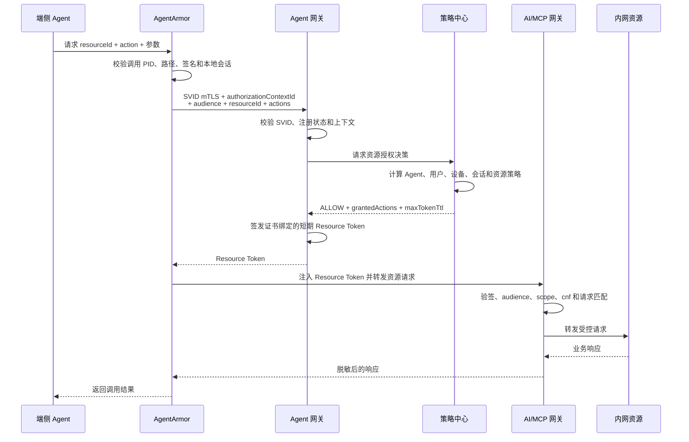
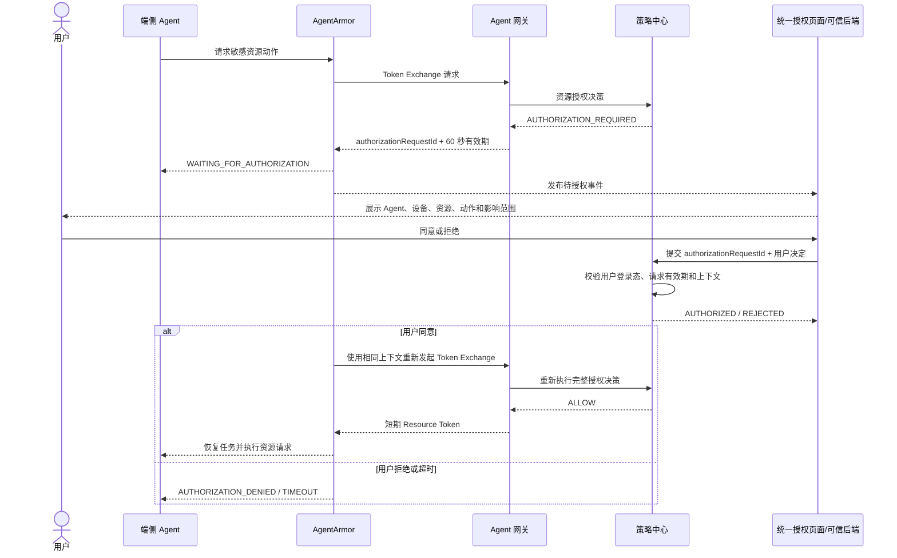
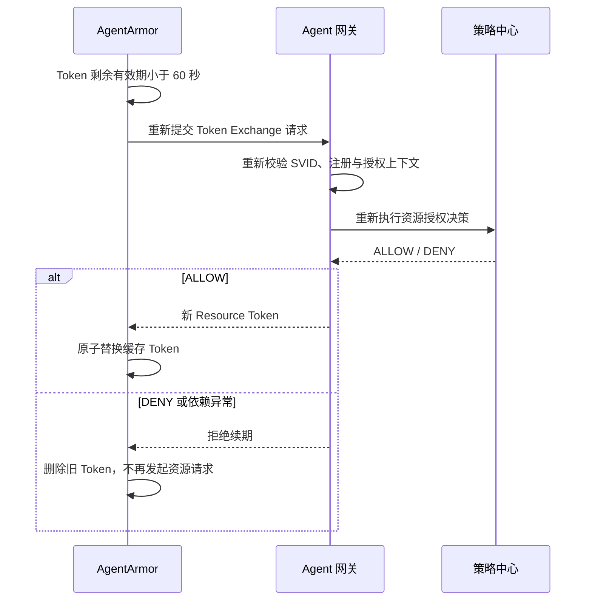
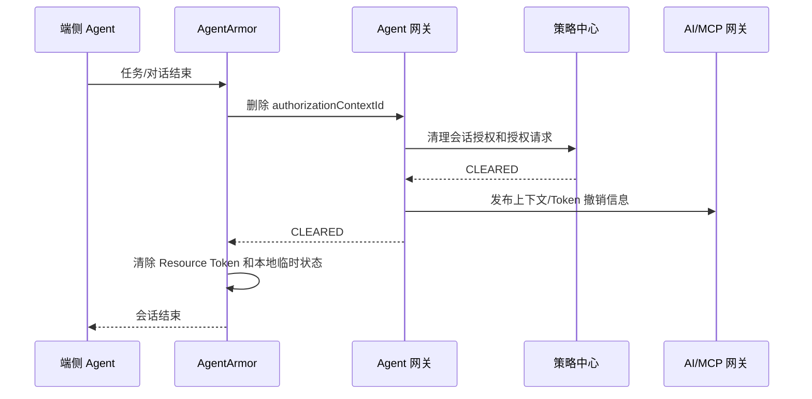

# AgentArmor 与 Agent 网关、策略中心集成方案

> 文档状态：完整设计方案，部分时效与容量参数待联调确认
> 讨论日期：2026-05-11
> 最后更新：2026-06-15
> 适用范围：Windows 端侧 Agent、AgentArmor、Agent 网关、IAM、权限策略中心、AI/MCP 网关
> 兼容原则：现有云侧 V1 接口与 `tokenId + toolId` 决策链路保持兼容，端侧能力通过新增接口和授权上下文演进

## 1. 背景与目标

现有云侧方案通过 Agent 网关隔离用户 Cookie，由 Agent 携带授权关联标识调用 MCP 网关，策略中心根据 Agent、用户、会话和工具策略作出授权决策。

AgentArmor 是部署在企业设备上的端侧安全插件，具备设备身份获取、本地进程校验、流量控制和凭证保护能力。端侧 Agent 不经过云侧 Agent 网关代理业务流量，但仍需复用云侧的 Agent 身份、人员策略、工具策略、人在回路授权和审计能力。

本方案的目标是：

1. IAM 统一管理云侧和端侧 Agent 身份，避免建立两套 Agent 身份目录。
2. AgentArmor 通过 Agent 网关的 Token Exchange 接口换取短期 Resource Token。
3. 策略中心作为统一 PDP，对端侧和云侧请求执行一致的授权决策。
4. Resource Token 仅由 AgentArmor 持有和注入，不暴露给 Agent 进程。
5. 端侧资源请求统一经过 AI/MCP 网关，由资源侧强制执行授权结果。
6. 复用云侧授权语义，但不把现有明文 `agentId:userId:conversationId` 当作安全凭证。

## 2. 核心结论

### 2.1 端侧是否绕过 Agent 网关

端侧 Agent 不通过 Agent 网关转发业务流量，但 AgentArmor 必须调用 Agent 网关的 Token Exchange 接口获取 Resource Token。

```text
业务流量：
Agent -> AgentArmor -> AI/MCP 网关 -> 内网资源

换证流量：
AgentArmor -> Agent 网关 Token Exchange -> 策略中心
```

因此，Agent 网关在端侧场景中承担身份交换和令牌签发职责，不承担端侧业务流量代理职责。

### 2.2 Agent 身份如何统一管理

- IAM 是 Agent 身份的权威注册簿。
- HIS MALL 在 Agent 上架、分发或下载时申请 `agentId`，并把发布信息同步到 IAM。
- 每个发布或接入形态使用独立且全局唯一的 `agentId`。即使两个 Agent 功能相同，只要是不同发布实体，也使用不同 `agentId`。
- 策略中心只引用 `agentId` 配置策略，不复制 Agent 身份详情。
- 端侧三元组 `userId + agentId + deviceId` 是 Agent 的注册绑定关系，不是 Agent 主键。

### 2.3 端侧授权记录能否复用云侧 Key

可以复用授权语义，不应直接复用现有明文 Key 作为凭证。

统一授权粒度为：

```text
agentId + userId + sessionId + resourceId + action
```

其中：

- 云侧 `sessionId` 对应现有 `conversationId`。
- 端侧 `sessionId` 对应一次任务或连续对话，任务结束即失效。
- MCP 场景下，`resourceId` 可取 `toolId`，`action` 可取 `INVOKE`。
- 非 MCP API 场景可使用标准化的资源 ID 和 HTTP/业务动作。

现有云侧 Redis Key：

```text
authz:{tokenId}:{toolId}
```

在 V1 兼容期继续保留。端侧新增不透明的 `authorizationContextId`，服务端保存其真实上下文：

```text
authctx:{authorizationContextId}
  -> agentId, userId, deviceId, sessionId, clientType, expiresAt
```

端侧授权记录建议使用：

```text
grant:{authorizationContextId}:{resourceId}:{action}
```

后续云侧迁移到不透明上下文后，可统一使用该模型。

### 2.4 策略中心如何对接

策略中心保持“只决策、不签 Token”的职责：

- 管理 Agent 与资源/工具绑定策略。
- 管理用户访问范围和人在回路授权。
- 校验设备、会话、资源和动作上下文。
- 返回 `ALLOW`、`AUTHORIZATION_REQUIRED` 或 `DENY`。
- 记录决策和授权审计。

Agent 网关调用策略中心完成决策，只有明确返回 `ALLOW` 时才签发 Resource Token。

### 2.5 Token 如何颁发给 AgentArmor

AgentArmor 使用 SVID 建立 mTLS，并提交用户委托凭证、授权上下文和目标资源。Agent 网关在一次服务端事务链中完成：

```text
认证 AgentArmor
-> 校验 Agent 注册绑定
-> 调用策略中心
-> 策略明确 ALLOW
-> 签发短期 Resource Token
```

Resource Token 只返回给 AgentArmor，由 AgentArmor 缓存并注入请求。Agent 进程不能读取 Token。

## 3. 总体架构



## 4. 身份模型

### 4.1 Agent 主身份

IAM 中的 Agent 主记录至少包含：

| 字段 | 含义 |
| --- | --- |
| `agentId` | 全局唯一 Agent 身份 |
| `agentName` | 展示名称 |
| `publisherId` | 发布方或责任主体 |
| `distributionChannel` | HIS MALL 等分发渠道 |
| `signingIdentity` | Agent 可执行文件签名主体或证书指纹 |
| `status` | `ACTIVE / SUSPENDED / REVOKED` |
| `createdAt` | 创建时间 |
| `updatedAt` | 更新时间 |

策略中心通过 `agentId` 引用 Agent，不以设备实例或进程实例生成新的 Agent ID。

### 4.2 端侧注册绑定

端侧首次登录后形成注册绑定：

```text
userId + agentId + deviceId
```

绑定记录建议包含：

| 字段 | 含义 |
| --- | --- |
| `registrationId` | 注册记录唯一 ID |
| `userId` | SSO 认证得到的用户 ID |
| `agentId` | IAM 中的 Agent ID |
| `deviceId` | xGate 提供的企业设备 ID |
| `agentSigningIdentity` | 本地 Agent 文件签名主体 |
| `status` | `ACTIVE / SUSPENDED / REVOKED` |
| `riskLevel` | 注册风险等级 |
| `lastAttestedAt` | 最近一次证明时间 |

同一个 Agent 可以在多个用户和设备上注册，但每个三元组独立管理、撤销和审计。

### 4.3 SVID

IAM 向 AgentArmor 颁发短效 SVID，用于证明 AgentArmor 当前代表已注册的端侧 Agent 工作负载。

建议身份 URI：

```text
spiffe://<trust-domain>/agent/<agentId>/device/<deviceId>
```

`userId` 不建议写入长期稳定的证书 Subject。用户身份和会话变化频率更高，应通过 User Scoped Token 和服务端授权上下文表达。

SVID 应绑定：

- `agentId`
- `deviceId`
- AgentArmor 工作负载身份
- 有效期
- 签发机构与证书链

## 5. 授权上下文模型

### 5.1 authorizationContextId

Agent 网关为每个端侧任务/对话创建不可预测的 `authorizationContextId`。该 ID 只用于服务端关联，不承载身份声明。

示例：

```text
actx_01JY7F9W4N8D6P3K2M5R
```

服务端上下文：

```json
{
  "authorizationContextId": "actx_01JY7F9W4N8D6P3K2M5R",
  "clientType": "ENDPOINT_AGENT",
  "agentId": "agent-endpoint-001",
  "userId": "user-42",
  "deviceId": "device-88",
  "sessionId": "session-20260615-001",
  "registrationId": "reg-001",
  "createdAt": "2026-06-15T08:00:00Z",
  "expiresAt": "2026-06-15T09:00:00Z"
}
```

### 5.2 与现有 tokenId 的关系

| 项目 | 云侧 V1 | 端侧新增模型 |
| --- | --- | --- |
| 关联标识 | `agentId:userId:conversationId` | 随机 `authorizationContextId` |
| 是否可解析 | 是 | 否 |
| 是否可作为凭证 | 否 | 否 |
| 身份来源 | Agent 网关上游上下文 | SVID + User Scoped Token + 注册绑定 |
| 服务端上下文 | 从明文 tokenId 解析 | 从 `authctx` 查询 |
| 最终访问凭证 | 当前链路中的受控 Token/Cookie | 签名 Resource Token |

现有 `tokenId` 和新增 `authorizationContextId` 都是授权关联标识，不是资源访问凭证。AI/MCP 网关只能接受可验证的 Resource Token。

## 6. Resource Token 设计

### 6.1 Token 载荷

Resource Token 建议采用短效 JWT 或等价的可验证令牌，至少包含：

```json
{
  "iss": "agent-gateway",
  "sub": "user-42",
  "aud": "mcp-gateway",
  "jti": "rt_01JY7...",
  "iat": 1781510400,
  "exp": 1781510700,
  "agent_id": "agent-endpoint-001",
  "device_id": "device-88",
  "session_id": "session-20260615-001",
  "authorization_context_id": "actx_01JY7F9W4N8D6P3K2M5R",
  "resource_id": "crm.customer",
  "actions": ["READ"],
  "cnf": {
    "x5t#S256": "<AgentArmor SVID certificate thumbprint>"
  }
}
```

### 6.2 Token 约束

- Token 的 `aud` 必须绑定目标 AI/MCP 网关或具体资源域。
- `resource_id + actions` 必须是本次策略决策允许的最小范围。
- 使用 `cnf` 将 Token 绑定到 AgentArmor mTLS 证书，降低复制和重放风险。
- Token 默认有效期建议为 5 分钟，联调阶段可在 2 至 10 分钟内调整。
- Token 不包含用户 Cookie、短信验证码、SSO 原始票据或完整设备信息。
- Token 不返回给 Agent 进程，不写入 Agent 日志或任务上下文。

### 6.3 Token 缓存与续期

AgentArmor 可以按以下键缓存 Token：

```text
authorizationContextId + audience + resourceId + actions
```

复用条件：

- Token 尚未过期且剩余有效期大于 60 秒。
- Agent、用户、设备和任务会话未变化。
- 资源与动作完全匹配，不允许用更大范围 Token 覆盖新请求。
- 本地 Agent PID 和签名校验仍有效。

Token 续期必须重新调用 Token Exchange 和策略中心，不允许仅凭旧 Token 离线续期。

## 7. 组件责任边界

| 组件 | 核心职责 | 明确不负责 |
| --- | --- | --- |
| HIS MALL | Agent 上架、分发、申请 `agentId` | 运行时授权决策、证书签发 |
| IDaaS | 用户 SSO、MFA、签发用户委托凭证 | Agent 身份和工具策略 |
| xGate | 提供企业设备 ID 和可信设备状态 | 用户授权、资源 Token 签发 |
| IAM | Agent 权威身份、三元组注册、风险校验、SVID 颁发和撤销 | 资源级业务策略决策 |
| Agent | 执行业务任务、通过本地接口请求资源 | 持有 Resource Token、声明自身权限 |
| AgentArmor | PID/路径/签名校验、本地请求拦截、SVID 与 Token 保管、Token 注入 | 制定策略、签发 Resource Token |
| Agent 网关 | Token Exchange、调用策略中心、签发短期 Resource Token | 端侧业务流量代理、保存业务资源凭证 |
| 策略中心 | Agent/用户/资源/动作策略、会话授权、决策与审计 | 身份认证、Token 签名、资源调用 |
| AI/MCP 网关 | Resource Token 验签、PoP 校验、请求约束和转发 | 替代策略中心管理规则 |
| 内网资源 | 业务逻辑和数据权限二次校验 | 信任 Agent 自报身份 |

## 8. 接口草案

### 8.1 创建端侧授权上下文

```http
POST /internal/endpoint-authorization-contexts
```

调用方：AgentArmor，通过 SVID/mTLS 认证。

请求：

```json
{
  "agentId": "agent-endpoint-001",
  "sessionId": "session-20260615-001",
  "userScopedToken": "<IDaaS user delegated token>"
}
```

`deviceId` 从 SVID、注册绑定和 mTLS 上下文获得，不接受客户端单独声明后直接信任。

响应：

```json
{
  "authorizationContextId": "actx_01JY7F9W4N8D6P3K2M5R",
  "expiresAt": "2026-06-15T09:00:00Z"
}
```

### 8.2 Token Exchange

```http
POST /internal/token-exchanges
```

调用方：AgentArmor，通过 SVID/mTLS 认证。

请求：

```json
{
  "authorizationContextId": "actx_01JY7F9W4N8D6P3K2M5R",
  "audience": "mcp-gateway",
  "resourceId": "crm.customer",
  "actions": ["READ"]
}
```

允许响应：

```json
{
  "status": "ISSUED",
  "accessToken": "<short-lived proof-of-possession resource token>",
  "tokenType": "DPoP-or-mTLS",
  "expiresIn": 300
}
```

需要用户授权：

```json
{
  "status": "AUTHORIZATION_REQUIRED",
  "authorizationRequestId": "areq_01JY7...",
  "resourceId": "crm.customer",
  "actions": ["DELETE"],
  "expiresIn": 60
}
```

拒绝响应：

```json
{
  "status": "DENIED",
  "reason": "USER_RESOURCE_ACCESS_DENIED",
  "traceId": "01JY7..."
}
```

### 8.3 策略中心决策接口

```http
POST /internal/resource-authorization-decisions
```

调用方：Agent 网关。

请求：

```json
{
  "authorizationContextId": "actx_01JY7F9W4N8D6P3K2M5R",
  "agentId": "agent-endpoint-001",
  "userId": "user-42",
  "deviceId": "device-88",
  "sessionId": "session-20260615-001",
  "clientType": "ENDPOINT_AGENT",
  "audience": "mcp-gateway",
  "resourceId": "crm.customer",
  "actions": ["READ"]
}
```

响应：

```json
{
  "decision": "ALLOW",
  "reason": "POLICY_ALLOWED",
  "grantedActions": ["READ"],
  "maxTokenTtlSeconds": 300
}
```

策略中心必须按服务端 `authctx` 重新核对上下文，不能只信任请求中的展开字段。

### 8.4 用户确认授权

```http
POST /internal/resource-authorizations
```

请求：

```json
{
  "authorizationRequestId": "areq_01JY7...",
  "approved": true
}
```

该接口由已验证用户登录态的可信业务后端或统一授权页面服务调用，不允许 Agent 或 AgentArmor 自行确认。

### 8.5 结束会话

```http
DELETE /internal/endpoint-authorization-contexts/{authorizationContextId}
```

删除后必须同步失效：

- 授权上下文。
- 当前任务/对话授权记录。
- 未完成授权请求。
- AgentArmor 中对应的 Resource Token 缓存。
- 网关侧可撤销或拒绝列表中的未过期 Token。

## 9. 关键时序

### 9.1 Agent 身份注册与 SVID 颁发



### 9.2 Token Exchange 与正常资源访问



### 9.3 人在回路授权



### 9.4 Token 续期



### 9.5 会话结束与清理



## 10. 策略模型

### 10.1 决策输入

统一策略决策至少包含：

```text
主体：
  userId
  agentId
  deviceId

上下文：
  clientType
  sessionId
  authorizationContextId
  devicePosture
  riskLevel

客体：
  audience
  resourceId
  actions
  resourceAttributes
```

### 10.2 决策顺序

```text
1. 授权上下文存在且未过期
2. Agent 在 IAM 中为 ACTIVE
3. userId + agentId + deviceId 注册绑定为 ACTIVE
4. 设备可信状态满足资源要求
5. Agent 已绑定目标资源或工具
6. 用户可以访问该 Agent 和目标资源
7. 请求动作在 Agent 允许范围内
8. 高风险动作存在当前会话用户授权
9. 所有检查通过后返回 ALLOW
```

任意依赖异常或上下文不一致均默认拒绝。

### 10.3 与现有工具策略兼容

MCP 场景可以映射为：

```text
resourceId = toolId
actions = ["INVOKE"]
```

现有：

```text
agentId + toolId + authMode
```

可以继续作为工具绑定和是否需要人在回路授权的真相源。新增端侧决策接口在内部复用相同仓储和规则，不复制第二份工具策略。

## 11. 安全约束

### 11.1 本地调用安全

- AgentArmor 接受本地连接时必须获取调用方 PID。
- 校验 PID 对应文件路径、文件哈希和企业数字签名。
- 本地接口使用 Windows Named Pipe、受限 Unix Domain Socket 等可获取对端身份的机制，避免使用无身份约束的普通 localhost 端口。
- 可增加一次性本地握手令牌，但该令牌只能作为附加保护，不能替代 PID 和签名校验。
- Agent 进程切换、文件更新或签名变化后必须重新校验。

### 11.2 Token 防护

- Resource Token 仅保存在 AgentArmor 内存或操作系统安全凭证区。
- 不通过标准输出、日志、IPC 响应或错误信息返回 Token。
- 使用 mTLS/PoP 绑定防止 Token 被复制到其他设备或进程使用。
- AI/MCP 网关必须校验请求的资源和动作不超过 Token 范围。
- 同一 `jti` 的异常并发、跨设备使用或高频重放应触发风控和撤销。

### 11.3 接口认证

- AgentArmor 到 Agent 网关：SVID 双向 TLS。
- Agent 网关到策略中心：工作负载身份/mTLS，不信任来源 IP 作为唯一认证手段。
- AI/MCP 网关到内网资源：使用网关工作负载身份，必要时附带受控用户/Agent 上下文。
- 用户确认接口：必须校验真实用户登录态和 `authorizationRequestId`，不能只提交 `authorizationContextId`。

## 12. 失败关闭规则

| 场景 | 处理 |
| --- | --- |
| SVID 无效、过期或被撤销 | 拒绝 Token Exchange，清理 AgentArmor Token 缓存 |
| Agent 状态为 `SUSPENDED/REVOKED` | 拒绝并终止当前上下文 |
| 三元组绑定不存在或已撤销 | 拒绝，不允许重新使用旧授权 |
| xGate 设备状态不可用或不可信 | 按资源策略拒绝；高安全资源必须要求实时设备状态 |
| User Scoped Token 过期 | 要求重新 SSO，不使用 SVID 替代用户身份 |
| 授权上下文不存在或过期 | 拒绝并要求创建新上下文 |
| 策略中心超时或不可用 | 不签发 Token |
| 策略返回 `AUTHORIZATION_REQUIRED` | 只创建授权挑战，不签发 Token |
| 用户拒绝或授权请求超时 | 不写授权记录，不签发 Token |
| Resource Token audience/scope/cnf 不匹配 | AI/MCP 网关拒绝请求 |
| 会话已清理但 Token 尚未自然过期 | 网关通过撤销状态或上下文查询拒绝 |

## 13. 身份与状态变化处理

### 13.1 证书撤销

- IAM 维护 SVID 状态和注册绑定状态。
- Agent 网关每次 Token Exchange 都必须校验证书链、有效期和撤销状态。
- 高风险资源可要求在线校验注册状态，不仅依赖证书有效期。
- Agent 被下架、签名证书泄露或设备丢失时，IAM 撤销注册绑定和 SVID。

### 13.2 用户状态变化

- 用户离职、冻结或组织权限变化后，IDaaS/IAM 应使 User Scoped Token 失效。
- 策略中心人员策略变更后，新 Token Exchange 立即使用新策略。
- 已签发 Token 通过短有效期控制暴露窗口；高风险场景结合撤销列表立即阻断。

### 13.3 设备状态变化

- 设备退出企业管理、xGate 判定不可信或设备证书撤销后，禁止签发新 Token。
- AgentArmor 收到设备状态变化事件后清理本地 Token 和授权上下文。
- AI/MCP 网关可对高风险请求查询上下文状态，阻断尚未过期的旧 Token。

## 14. 审计要求

端侧与云侧使用统一审计关联字段：

```json
{
  "eventType": "RESOURCE_TOKEN_ISSUED",
  "occurredAt": "2026-06-15T08:05:00Z",
  "traceId": "01JY7...",
  "authorizationContextId": "actx_01JY7F9W4N8D6P3K2M5R",
  "registrationId": "reg-001",
  "agentId": "agent-endpoint-001",
  "userId": "user-42",
  "deviceId": "device-88",
  "sessionId": "session-20260615-001",
  "clientType": "ENDPOINT_AGENT",
  "audience": "mcp-gateway",
  "resourceId": "crm.customer",
  "actions": ["READ"],
  "decision": "ALLOW",
  "reason": "POLICY_ALLOWED",
  "tokenId": "rt_01JY7...",
  "expiresAt": "2026-06-15T08:10:00Z"
}
```

至少记录：

- Agent 注册、更新和撤销。
- SVID 颁发、续期和撤销。
- 授权上下文创建与清理。
- Token Exchange 请求和策略决策。
- 用户授权挑战、同意、拒绝和超时。
- Resource Token 签发、续期和拒绝。
- AI/MCP 网关验签失败、scope 不匹配和 PoP 失败。
- 最终资源访问结果。

审计日志不得记录 User Scoped Token、Resource Token 全文、Cookie、密码、验证码或私钥。

## 15. 与云侧方案的统一和差异

| 维度 | 云侧 Agent | 端侧 AgentArmor |
| --- | --- | --- |
| Agent 身份权威 | IAM | IAM |
| 用户身份 | IDaaS/业务后端登录态 | IDaaS User Scoped Token |
| 设备身份 | 通常不参与 | xGate + deviceId |
| 业务流量是否经过 Agent 网关 | 是 | 否 |
| 是否调用 Agent 网关换证 | 是 | 是 |
| 授权决策 | 策略中心 | 策略中心 |
| 资源入口 | MCP 网关 | AI/MCP 网关 |
| 凭证保管 | Agent 网关隔离 Cookie/Token | AgentArmor 隔离 Resource Token |
| 会话粒度 | conversationId | task/sessionId |
| Agent 是否接触原始凭证 | 否 | 否 |

统一的是身份目录、策略语义、授权流程和审计；不同的是凭证隔离位置和业务流量路径。

## 16. 演进与兼容策略

### 阶段一：端侧独立接入

- 保持现有云侧 `tokenId + toolId` 接口不变。
- 新增端侧授权上下文、资源决策和 Token Exchange 接口。
- 策略中心内部复用现有 Agent/工具/人员策略仓储。
- MCP 场景通过 `resourceId = toolId` 映射复用现有工具策略。

### 阶段二：统一不透明授权上下文

- 云侧 Agent 网关也改为生成随机 `authorizationContextId`。
- 策略中心从服务端 `authctx` 读取 `agentId + userId + conversationId/sessionId`。
- MCP 网关调用协议仍可保持“关联 ID + toolId”，降低迁移影响。
- 明文 `agentId:userId:conversationId` 逐步退出运行时链路。

### 阶段三：统一资源授权与 Token Exchange

- 云侧和端侧均通过统一资源决策模型。
- 策略中心统一管理工具、API、Agent 和 A2A 资源。
- Agent 网关统一签发面向不同 audience 的短期 Resource Token。

## 17. 联调参数

以下参数采用安全默认值，联调时可在不改变模型的前提下调整：

| 参数 | 默认值 | 可调整范围 |
| --- | ---: | ---: |
| Resource Token 有效期 | 300 秒 | 120 至 600 秒 |
| Token 提前续期阈值 | 60 秒 | 30 至 120 秒 |
| 授权挑战有效期 | 60 秒 | 60 至 180 秒 |
| 授权上下文最大空闲时间 | 60 分钟 | 15 至 120 分钟 |
| SVID 有效期 | 24 小时 | 1 至 24 小时 |
| 策略中心决策超时 | 2 秒 | 1 至 3 秒 |

生产环境必须通过风险评估确定最终值，不得通过延长 Token 有效期解决可用性问题。

## 18. 验收场景

1. 合法 AgentArmor 使用有效 SVID、有效用户委托和可信设备成功创建授权上下文。
2. Agent 进程签名不合法时，AgentArmor 不发起 Token Exchange。
3. AgentArmor 请求已绑定、用户可访问且无需人在回路的资源，成功获得最小范围 Resource Token。
4. Resource Token 不能被其他设备、其他 AgentArmor 证书或 Agent 进程直接使用。
5. 请求未绑定资源时，策略中心返回 `DENY`，Agent 网关不签 Token。
6. 高风险动作首次请求返回 `AUTHORIZATION_REQUIRED`，用户确认后重新决策并签发 Token。
7. 用户拒绝或授权挑战超时后不产生授权记录和 Resource Token。
8. Token 的 resource、action 或 audience 与实际请求不匹配时，AI/MCP 网关拒绝。
9. 策略中心、IAM、xGate 或授权存储异常时链路默认拒绝。
10. 会话结束后授权上下文、授权记录和 AgentArmor Token 缓存被清理。
11. Agent、用户或设备被撤销后不能签发新 Token，高风险旧 Token 被立即阻断。
12. 云侧现有 `tokenId + toolId` 决策和会话授权接口不受端侧新增接口影响。

## 19. 最终推荐

推荐采用以下责任分配：

```text
IAM：
  管理 Agent 权威身份、三元组注册和 SVID

Agent 网关：
  提供 Token Exchange，原子调用策略并签发 Resource Token

策略中心：
  统一管理 Agent、用户、会话、资源和动作策略

AgentArmor：
  校验本地 Agent，保管和注入 Resource Token

AI/MCP 网关：
  验证 Resource Token 并执行资源侧访问控制
```

端侧与云侧不需要使用完全相同的流量路径，但必须共享同一身份命名空间、策略决策体系和审计链路。现有明文 `tokenId` 可以继续用于云侧 V1 兼容，但不得扩展为端侧安全凭证；端侧应直接采用不透明授权上下文和证书绑定的短期 Resource Token。
