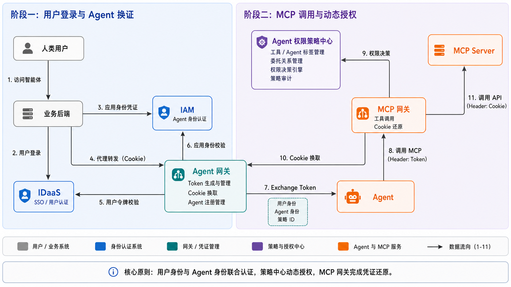

# 集成 TMG：云端 Agent 集成委托授权解决方案

> 文档定位：集成TMG 会议项目进展与方案汇报材料

## 项目概览

| 项目 | 当前状态 |
| --- | --- |
| 核心安全能力 | Agent 网关、Agent 权限策略中心和 MCP 网关的核心链路已实现 |
| 集成 Agent 联调 | 总体完成度约 80% |
| 测试环境计划 | 2026 年 6 月 16 日上线 |
| 财经业务联调 | 2026 年 6 月 16 日至 6 月 25 日 |
| 财经 Eureka 系列 Agent 生产支撑 | 计划于 2026 年 7 月 18 日上线 |

## 1. Agent 安全项目情况说明

当前云侧 Agent 委托授权安全解决方案已完成核心功能建设，形成了由 Agent 网关、Agent 权限策略中心和 MCP 网关共同组成的安全调用链路。

结合公司AI辅助研发导向，3位核心开发人员并行协作完成Agent 委托鉴权项目开发，历时 4 天时间高强度攻关完成了从 0 到 1 的MVP版本方案设计与工程建设。完成整体方案设计、技术选型、可行性论证、代码开发、环境部署、集成agent联调。
累计产出 **4 万余行核心代码、20 余项核心特性和 10 余篇架构设计文档**。

项目由三名核心开发人员协同推进：

| 人员 | 角色与职责                                             |
| --- |---------------------------------------------------|
| 牛伟才 | 整体解决方案负责人，负责总体架构设计、方案推进以及多个领域的业务对接与协同。            |
| 徐宁 | 技术架构负责人，负责策略中心架构设计与核心能力开发。                        |
| 雷昊毅 | Agent 网关核心开发者，负责 Agent 流量通道能力建设、路由分发和认证 Token 颁发。 |

目前已完成 Agent 委托授权人在回路链路的最小路径设计与实现。
### 核心安全闭环

```text
业务后端提交用户上下文和 Cookie
    -> Agent 网关拦截 Cookie 并下发受控 Token
    -> Agent 携带 Token 调用 MCP 网关
    -> MCP 网关向策略中心请求工具权限决策
    -> 决策允许后换取 Cookie
    -> MCP 网关注入 Cookie 并调用 MCP Server
```

该链路遵循四项核心原则：

1. 用户身份与 Agent 身份联合认证。
2. 用户 Cookie 不进入 Agent，由 Agent 网关隔离保存。
3. 低风险工具按策略直接放行，高风险工具执行动态授权。
4. 敏感工具调用由用户进行人在回路确认。

前期围绕信任边界、凭证隔离、动态授权、工具分级和系统职责进行了充分的架构讨论与设计，当前 MVP 能够在保持核心模型稳定的基础上，平滑演进为生产级、高可用的 Agent 安全产品。



## 2. Agent 安全服务能力建设进展

| 服务模块 | 已建设能力 | 当前进展 |
| --- | --- | --- |
| Agent 权限策略中心 | 授权记录原子建模、Agent 工具分级策略绑定、权限策略执行引擎、人员访问策略控制 | 核心模型、管理接口和实时决策能力已完成，可按 Agent、工具、用户及当前对话授权状态执行策略判断。 |
| Agent 网关 | Agent 身份管理、通道路由分发、用户 Cookie 拦截与隔离、认证 Token 下发 | Agent 接入和代理通道基础能力已完成，Agent 不直接接触用户 Cookie。 |
| MCP 网关 | 工具策略校验、Cookie 还原与注入、受控工具调用 | 策略决策链路已接入，仅在策略中心明确允许后换取 Cookie 并调用 MCP Server。 |

## 3. 集成 Agent 联调进展

当前集成 Agent 联调总体完成度约为 **80%**，核心后端链路已经基本贯通，剩余工作集中在用户授权交互和端到端验收。

### 3.1 已完成

| 联调事项 | 状态 | 结果 |
| --- | --- | --- |
| Agent 身份注册与工具绑定 | 已完成 | Agent 已能够完成身份注册，并与允许调用的工具建立配置关系。 |
| 工具策略分级配置 | 已完成 | 已支持无需用户授权和需要用户授权的工具策略配置。 |
| 代理通道转发 | 已完成 | 业务请求可经 Agent 网关代理通道转发至目标 Agent。 |
| 无需授权链路调试 | 已完成 | 策略允许后可完成 Cookie 换取及工具调用。 |
| 需要授权链路调试 | 已完成核心后端链路 | 策略中心能够识别待授权状态，并在授权记录存在后放行工具调用。 |

### 3.2 未完成

| 联调事项 | 状态 | 后续工作 |
| --- | --- | --- |
| 前端授权卡片开发 | 待完成 | 展示当前 Agent 请求调用的工具信息，承接用户确认或拒绝操作。 |
| 人在回路委托授权端到端链路 | 待完成 | 串联授权卡片、业务后端确认、授权记录写入、Agent 任务恢复和最终工具调用。 |

后续联调完成标准是：用户能够在业务页面看到授权请求，完成明确确认后，Agent 从等待状态恢复并成功调用目标工具；拒绝或超时情况下，链路应终止且不得换取 Cookie。

## 4. Agent 安全能力建设与财经业务支撑时间计划表

| 时间 | 里程碑 | 主要工作与交付结果 |
| --- | --- | --- |
| 2026 年 6 月 16 日 | 测试环境上线 | Agent 权限策略中心和 Agent 网关部署至测试环境，具备财经业务 Agent 联调条件。 |
| 2026 年 6 月 16 日至 6 月 25 日 | 财经业务 Agent 联调验证 | 完成 Agent 注册、工具绑定、工具策略配置、代理通道转发、授权与无需授权链路验证，并闭环联调问题。 |
| 2026 年 6 月 25 日至 7 月 15 日 | A2A 场景人在回路能力开发与验证 | 完成 A2A 委托授权、下游 Agent 敏感工具授权、人在回路等待与恢复等能力开发及验证。 |
| 2026 年 7 月 18 日 | 生产环境上线支撑 | Agent 安全解决方案支撑财经 Eureka 系列 Agent 上线生产环境。 |

时间计划的关键交付路径为：

```text
测试环境就绪
    -> 财经业务 Agent 联调闭环
    -> A2A 人在回路能力完成
    -> 财经 Eureka 系列 Agent 生产上线
```

## 5. TMG 会议 Agent 安全会议内容

本次 TMG 会议建议围绕“方案背景、业务问题、接入路径和落地效果”展开，会议内容分为平台侧说明、财经业务侧说明和现场演示三部分。

| 会议环节 | 主要内容 | 建议输出 |
| --- | --- | --- |
| 平台侧方案介绍 | Agent 安全建设背景、云端 Agent 委托授权整体解决方案、核心安全原则和系统职责边界 |
| 平台侧对接旅程 | Agent 注册、工具绑定、策略配置、网关接入、授权交互和联调验收流程 |
| 财经业务背景 | 财经 Agent 的真实使用场景、现有系统调用方式及敏感工具使用需求 |
| 财经实际问题 | Agent 直接持有用户凭证、工具越权调用、高风险操作缺少确认、调用链难追溯等问题 |
| 落地效果演示 | 演示云侧 Agent 通过网关换证、策略校验、无需授权调用和人在回路授权调用 |

演示至少覆盖两条路径：

1. **无需授权工具路径**：Agent 调用工具，策略中心直接允许，MCP 网关换取 Cookie 后完成调用。
2. **需要授权工具路径**：Agent 调用敏感工具，系统进入待授权状态，用户确认后写入当前对话授权，Agent 恢复并完成调用。

## 6. 服务能力建设规划

### 6.1 近期：完成联调闭环

- 集成agent前端授权卡片开发，明确展示 Agent、工具和本次授权范围。
- 完成集成 Agent 人在回路委托授权端到端验收。， Agent调用工具无权限后挂起，等待人在环授权，检查点恢复和授权后重试。
- 补齐用户拒绝、授权超时、策略中心异常和 Cookie 换取失败等链路。
- 补齐角色策略控制模型设计，优化当前策略中心交互界面
- agent网关与agent策略中心上线测试环境
### 6.2 后续：生产化能力演进

| 建设方向 | 规划能力 |
| --- | --- |
| 策略中心 | 支持角色域策略控制，在现有精确用户策略基础上扩展角色维度的 Agent 与工具访问边界。 |
| 策略中心 | 支持 A2A 委托授权，对 Agent 调用 Agent 场景中的委托关系、目标工具和用户授权进行分层决策。 |
| 策略中心与 Agent 网关 | 支持更高安全等级的 Token 令牌颁发与校验，增强令牌防伪造、防重放、有效期和上下文约束能力。 |
| Agent 网关 | 支持 Agent 流量控制、限流保护和调用链可观测，提升异常发现与问题定位能力。 |
| Agent 网关 | 支持角色管控拦截，在请求进入 Agent 或下游能力前执行角色访问边界校验。 |
| Agent 网关 | 建设高可用通道分发能力，支持多实例部署、故障转移、弹性扩容和稳定性保障。 |

后续演进将保持现有 MVP 的核心原则不变，在统一身份、凭证隔离、实时策略决策和人在回路授权模型上逐步增加角色域、A2A、高安全令牌、流控、可观测和高可用能力。
