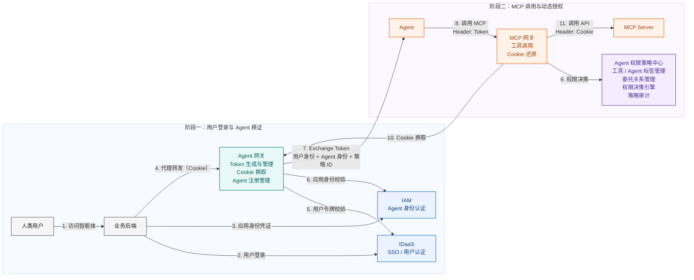

# Agent 认证与 MCP 动态授权架构

```mermaid
flowchart LR
    subgraph phase1["阶段一：用户登录与 Agent 换证"]
        direction TB

        human["人类用户"]
        backend["业务后端"]
        idaas["IDaaS<br/>SSO / 用户认证"]
        iam["IAM<br/>Agent 身份认证"]
        agentGateway["Agent 网关<br/>Token 生成与管理<br/>Cookie 换取<br/>Agent 注册管理"]

        human -->|"1. 访问智能体"| backend
        backend -->|"2. 用户登录"| idaas
        backend -->|"3. 应用身份凭证"| iam
        backend -->|"4. 代理转发（Cookie）"| agentGateway
        agentGateway -->|"5. 用户令牌校验"| idaas
        agentGateway -->|"6. 应用身份校验"| iam
    end

    subgraph phase2["阶段二：MCP 调用与动态授权"]
        direction TB

        agent["Agent"]
        mcpGateway["MCP 网关<br/>工具调用<br/>Cookie 还原"]
        policyCenter["Agent 权限策略中心<br/>工具 / Agent 标签管理<br/>委托关系管理<br/>权限决策引擎<br/>策略审计"]
        mcpServer["MCP Server"]

        agent -->|"8. 调用 MCP<br/>Header: Token"| mcpGateway
        mcpGateway -->|"9. 权限决策"| policyCenter
        mcpGateway -->|"11. 调用 API<br/>Header: Cookie"| mcpServer
    end

    agentGateway -->|"7. Exchange Token<br/>用户身份 + Agent 身份 + 策略 ID"| agent
    mcpGateway -->|"10. Cookie 换取"| agentGateway

    classDef actor fill:#f5f5f5,stroke:#707070,color:#202020,stroke-width:1.5px;
    classDef identity fill:#eaf3ff,stroke:#2878d0,color:#123f75,stroke-width:1.5px;
    classDef gateway fill:#e7f8f7,stroke:#168c8c,color:#075f60,stroke-width:1.5px;
    classDef policy fill:#f3edff,stroke:#7650b5,color:#4e2b87,stroke-width:1.5px;
    classDef service fill:#fff2e8,stroke:#ed7417,color:#9a4108,stroke-width:1.5px;

    class human,backend actor;
    class idaas,iam identity;
    class agentGateway gateway;
    class policyCenter policy;
    class agent,mcpGateway,mcpServer service;

    style phase1 fill:#f7fbff,stroke:#b8d5f5,stroke-width:1px;
    style phase2 fill:#fbf8ff,stroke:#d7c5ef,stroke-width:1px;
```

> 核心原则：用户身份与 Agent 身份联合认证，策略中心动态授权，MCP 网关完成凭证还原。
