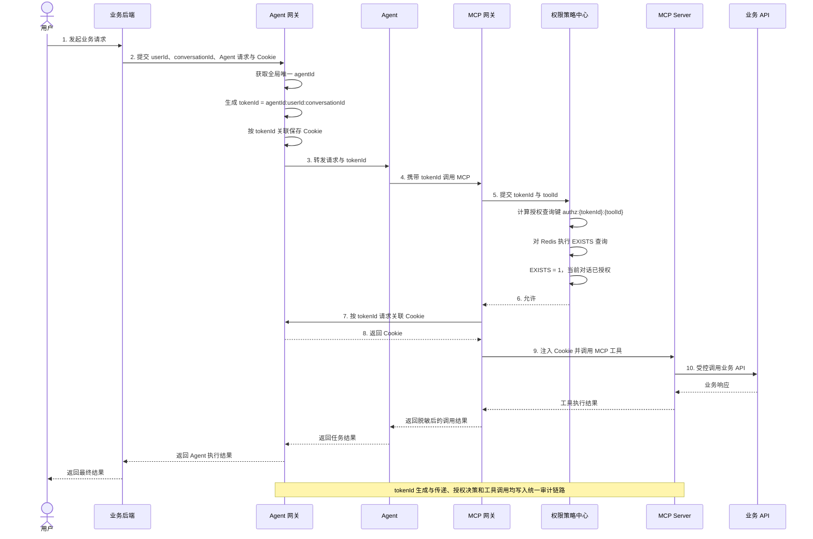
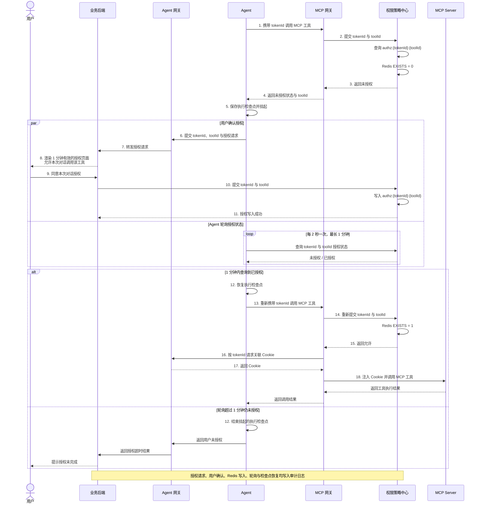

# Agent 动态授权项目总体架构

> 文档定位：项目目标总体架构（Architecture Baseline）。后续模块设计、接口定义和代码实现默认以此为基线。
> 关注范围：Agent 请求接入、tokenId 生成与传递、动态授权及 MCP 工具调用。
> 说明：IAM、IDaaS 等认证系统可作为 Agent 网关的内部依赖存在，但不属于本方案的架构边界。

## 总体架构图

```mermaid
flowchart LR
    subgraph access["Agent 接入平面"]
        direction LR
        user["用户"]
        backend["业务后端<br/>承接用户请求与业务会话<br/>提供 userId、conversationId 与 Cookie"]
        agentGateway["Agent 网关<br/>请求接入与转发<br/>生成 tokenId<br/>关联保存 Cookie<br/>Agent 路由"]
        agent["Agent<br/>任务执行与 MCP 调用"]

        user -->|"1. 发起业务请求"| backend
        backend -->|"2. userId + conversationId<br/>Agent 请求 + Cookie"| agentGateway
        agentGateway -->|"3. 转发请求 + tokenId<br/>agentId:userId:conversationId"| agent
    end

    subgraph mcpAccess["MCP 接入平面"]
        direction TB
        mcpGateway["MCP 网关<br/>授权流程编排<br/>工具路由<br/>Cookie 获取与注入"]
    end

    subgraph control["动态授权平面"]
        direction TB
        policyCenter["权限策略中心<br/>Redis 用户授权缓存<br/>tokenId + toolId 授权检查<br/>允许 / 拒绝<br/>决策审计"]
    end

    subgraph resource["MCP 资源平面"]
        direction LR
        mcpServer["MCP Server<br/>工具实现与协议适配"]
        businessApi["企业业务系统 / 工具 API"]
        mcpServer -->|"10. 受控调用"| businessApi
    end

    subgraph operations["审计与可观测平面"]
        direction TB
        audit["统一审计日志<br/>tokenId / 决策 / 工具调用"]
        observability["可观测性<br/>Metrics / Tracing / Alert"]
        audit --> observability
    end

    agent -->|"4. 携带 tokenId 调用 MCP"| mcpGateway
    mcpGateway -->|"5. tokenId + toolId"| policyCenter
    policyCenter -->|"6. 允许 / 拒绝"| mcpGateway
    mcpGateway -->|"7. 允许后按 tokenId 获取 Cookie"| agentGateway
    agentGateway -->|"8. 返回关联 Cookie"| mcpGateway
    mcpGateway -->|"9. 注入 Cookie 并调用工具"| mcpServer

    agentGateway -.-> audit
    mcpGateway -.-> audit
    policyCenter -.-> audit
    mcpServer -.-> audit

    classDef actor fill:#f5f5f5,stroke:#666,color:#222,stroke-width:1.5px;
    classDef gateway fill:#e7f8f7,stroke:#168c8c,color:#075f60,stroke-width:1.5px;
    classDef policy fill:#f3edff,stroke:#7650b5,color:#4e2b87,stroke-width:1.5px;
    classDef service fill:#fff2e8,stroke:#ed7417,color:#9a4108,stroke-width:1.5px;
    classDef ops fill:#edf7ed,stroke:#438a45,color:#245426,stroke-width:1.5px;

    class user,backend actor;
    class agentGateway,mcpGateway gateway;
    class policyCenter policy;
    class agent,mcpServer,businessApi service;
    class audit,observability ops;

    style access fill:#f3fbfa,stroke:#9fd6d3,stroke-width:1px;
    style mcpAccess fill:#f3fbfa,stroke:#9fd6d3,stroke-width:1px;
    style control fill:#fbf8ff,stroke:#d7c5ef,stroke-width:1px;
    style resource fill:#fffaf5,stroke:#f3c49e,stroke-width:1px;
    style operations fill:#f6fbf6,stroke:#b8d8b9,stroke-width:1px;
```

## 核心调用时序图

## 未授权人在回路授权时序图

## 人在回路授权说明

- Agent 收到 `未授权 + toolId` 后保存执行检查点，挂起当前工具调用。
- Agent 通过 Agent 网关将 `tokenId + toolId` 授权请求传递给业务后端，由业务后端展示用户授权页面。
- 授权页面与服务端授权会话均只在 1 分钟内有效，超时后前端禁用确认，服务端同时拒绝提交。
- 当前版本只支持“本次对话”授权，不提供跨对话或长期授权选项。
- 用户确认后，业务后端调用权限策略中心，提交 `tokenId + toolId`。
- 权限策略中心写入 `authz:{tokenId}:{toolId}`，该记录仅对当前 tokenId 对应的对话有效。
- Agent 挂起期间每 2 秒直接查询权限策略中心，最长等待 1 分钟。
- 查询成功后，Agent 恢复检查点并重新调用 MCP 网关；MCP 网关必须重新执行授权检查，不得直接沿用首次未授权请求。
- 1 分钟内仍未授权时，Agent 结束挂起任务并通过 Agent 网关、业务后端返回用户未授权结果。
- 对话结束时，业务后端通知权限策略中心删除该 tokenId 对应的所有工具授权记录。

## 核心链路

1. **业务接入与 tokenId 生成**：用户首先请求业务后端；业务后端向 Agent 网关提交 userId、conversationId、Agent 请求和 Cookie。Agent 网关结合全局唯一 agentId 生成 `tokenId = agentId:userId:conversationId`，并按 tokenId 关联保存 Cookie。
2. **运行时动态授权**：Agent 将 tokenId 传递给 MCP 网关；MCP 网关向权限策略中心提交 tokenId 和 toolId，策略中心查询 `authz:{tokenId}:{toolId}` 判断当前对话是否已经授权。
3. **授权执行与 Cookie 获取**：权限策略中心只返回允许或拒绝；MCP 网关仅在收到允许结果后，才按 tokenId 向 Agent 网关获取 Cookie。
4. **工具与资源访问**：MCP Server 负责工具实现和协议适配，最终受控访问业务 API。
5. **默认拒绝与审计**：授权 Key 不存在、策略服务异常或策略中心返回拒绝时均终止调用；关键步骤写入统一审计链路。

## 组件职责

| 组件 | 核心职责 | 不应承担的职责 |
| --- | --- | --- |
| 业务后端 | 承接用户请求和业务会话、向 Agent 网关传递 userId、conversationId、Agent 请求与 Cookie、返回执行结果 | 生成 tokenId、动态权限决策、MCP 工具执行 |
| Agent 网关 | Agent 路由、生成 tokenId、按 tokenId 关联保存 Cookie、向 Agent 转发请求和 tokenId | 动态权限决策、MCP 工具执行 |
| Agent | 任务执行、携带 tokenId 发起 MCP 调用、未授权时挂起检查点并轮询授权状态 | 解析 tokenId 判断权限、接触原始业务凭证 |
| MCP 网关 | 接收 MCP 调用、提交 tokenId 和 toolId、根据授权结果控制放行、按 tokenId 获取并注入 Cookie | 生成 tokenId、制定全局权限策略、长期保存 Cookie |
| 权限策略中心 | 查询 `authz:{tokenId}:{toolId}`、写入本次对话授权、清理对话授权、返回允许或拒绝 | 生成 tokenId、直接调用 MCP 工具 |
| MCP Server | 工具实现、协议适配、使用受控调用上下文访问业务 API | tokenId 生成、全局策略管理 |

## 动态授权接口

### tokenId

- 格式固定为 `agentId:userId:conversationId`。
- `agentId` 由 Agent 网关确定，并且必须全局唯一。
- `userId` 和 `conversationId` 由业务后端传递。
- 三个字段必须非空，并且禁止包含分隔符 `:`。
- tokenId 仅用于关联一次 Agent 对话的工具授权，不是加密或签名 Token。

### Cookie 传递与保存

- 业务后端在请求 Agent 网关时，同时传递 Cookie。
- Agent 网关生成 tokenId 后，建立 tokenId 与 Cookie 的受控关联。
- Agent 仅接收 tokenId，不接收 Cookie。
- 权限策略中心返回允许后，MCP 网关才可按 tokenId 向 Agent 网关获取 Cookie。
- MCP 网关将 Cookie 注入获准的 MCP 工具调用，不长期保存 Cookie。

### 权限策略中心决策输入

- `tokenId`。
- `toolId`。

### 权限策略中心决策输出

- `允许` 或 `拒绝`。

### 本次对话授权确认

- 业务后端提交 `tokenId + toolId`。
- 授权页面和对应服务端授权请求仅在创建后的 1 分钟内有效。
- 策略中心校验授权请求仍有效后，写入 `authz:{tokenId}:{toolId}`。
- 当前接口不接收有效期或授权范围参数，写入结果仅代表当前对话授权。

### 对话授权清理

- 业务后端在对话结束或删除时提交 `tokenId`。
- 策略中心删除匹配 `authz:{tokenId}:*` 的授权记录。
- 实现时应维护 tokenId 对应的已授权 toolId 集合或索引进行精确清理，不应在生产环境使用阻塞式 Redis `KEYS` 扫描。

### Redis 授权记录

- Redis 授权记录的 Key 格式固定为 `authz:{tokenId}:{toolId}`。
- 策略中心根据 tokenId 和 toolId 计算出查询键，再对 Redis 执行 `EXISTS`；计算出键名不代表 Redis 中一定存在该记录。
- `EXISTS = 1` 表示该 tokenId 已被授权调用目标工具，策略中心返回允许。
- `EXISTS = 0` 表示目标工具未授权，策略中心返回拒绝。
- 授权记录仅在用户通过 1 分钟有效的授权页面确认后写入，并在当前对话结束时清理。

## 架构约束

- Agent 网关负责生成 tokenId，权限策略中心负责使用 tokenId 和 toolId 检查工具授权，两者职责不得混用。
- `agentId` 必须全局唯一，避免不同 Agent 使用相同 userId 和 conversationId 时产生 tokenId 冲突。
- `agentId`、`userId`、`conversationId` 必须非空且不得包含 `:`，确保 tokenId 可被无歧义地构造和解析。
- tokenId 是授权关联标识，不应被视为身份凭证或防篡改安全 Token。
- 系统默认拒绝；只有权限策略中心明确返回允许时，MCP 网关才能放行并调用 MCP Server。
- Redis 授权 Key 不存在、策略服务超时或不可用时不得降级放行。
- 当前版本的授权范围只能是本次对话，不得复用于其他 conversationId。
- Agent 不得接触 Cookie、长期 Token、密钥或其他原始业务凭证。
- Agent 网关必须隔离保存 Cookie，并且只允许 MCP 网关在策略中心返回允许后按 tokenId 获取。
- MCP 网关不得在授权判断前获取 Cookie，也不得长期保存 Cookie。
- 所有关键步骤必须携带 tokenId，支持从用户请求追踪到授权决策和最终工具调用。
- tokenId 生成、授权查询、允许/拒绝和 MCP 调用必须记录安全审计事件。

## 逻辑模块建议

- `agent-gateway`：请求接入、Agent 路由、tokenId 生成、Cookie 关联保存和请求转发。
- `mcp-gateway`：MCP 接入、提交 tokenId 与 toolId、授权结果执行、Cookie 获取与注入和工具路由。
- `policy-center`：Redis 用户授权缓存、`authz:{tokenId}:{toolId}` 查询、工具授权判断和决策审计。
- `security-contract`：tokenId、工具授权校验请求与响应、错误码和审计事件。
- `audit-observability`：统一审计、指标、链路追踪和告警。

## 相关文档

- [未来授权能力演进](future/future-authorization-evolution.md)
